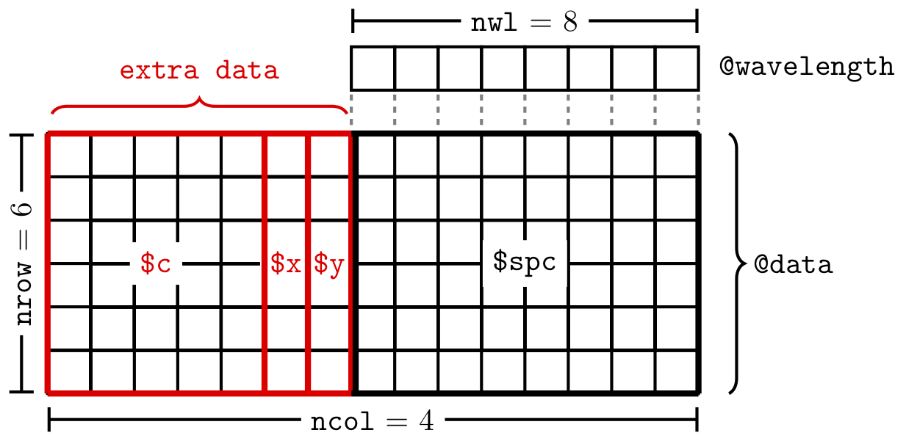

---
# For vignette ---------------------------------------------------------------
title:        Introduction to Package "hyperSpec"
subtitle:     'The Main Manual of Package "hyperSpec"'
description:  "Introduction: hyperSpec's main manual."
# Authors --------------------------------------------------------------------
author:
  - name: Claudia Beleites^1,2,3,4,5^, Vilmantas Gegzna, Bryan A. Hanson
    email: chemometrie@beleites.de
    corresponding : yes
    affiliation   : |
        1. DIA Raman Spectroscopy Group, University of Trieste/Italy (2005--2008)
        2. Spectroscopy $\cdot$ Imaging, IPHT, Jena/Germany (2008--2017)
        3. ÖPV, JKI, Berlin/Germany (2017--2019)
        4. Arbeitskreis Lebensmittelmikrobiologie und Biotechnologie, Hamburg University, Hamburg/Germany (2019 -- 2020)
        5. Chemometric Consulting and Chemometrix GmbH, Wölfersheim/Germany (since 2016)
# Document -------------------------------------------------------------------
date:        "`r Sys.Date()`"
output:
    bookdown::html_document2:
      base_format: rmarkdown::html_vignette
      toc: yes
      toc_depth: 2
      fig_caption: yes
      number_sections: true
      css:
        - vignette.css
        - style.css
vignette: >
    % \VignetteIndexEntry{Introduction to Package "hyperSpec"}
    % \VignetteKeyword{hyperSpec}
    % \VignettePackage{hyperSpec}
    % \VignetteEngine{knitr::rmarkdown}
    % \VignetteEncoding{UTF-8}
# Citations/References -------------------------------------------------------
link-citations: yes
bibliography: resources/intro-pkg.bib
biblio-style: plain
csl: elsevier-with-titles.csl
# Pkgdown --------------------------------------------------------------------
pkgdown:
  as_is: true
---


```{r cleanup-hyperspec, include = FALSE}
# Clean up to ensure reproducible workspace ----------------------------------
rm(list = ls(all.names = TRUE))
```

```{r setup, include = FALSE}
# Packages -------------------------------------------------------------------
library(hyperSpec)
library(mvtnorm)
library(pls)
library(colorspace)

# Functions ------------------------------------------------------------------
source("vignette-functions.R", encoding = "UTF-8")

# Settings -------------------------------------------------------------------
source("vignette-default-settings.R", encoding = "UTF-8")

# Temporary options ----------------------------------------------------------
# Change the value of this option in "vignette-default-settings.R"
show_reviewers_notes = getOption("show_reviewers_notes", TRUE)
```


```{r bib, echo = FALSE, paged.print = FALSE}
dir.create("resources", showWarnings = FALSE)

knitr::write_bib(
  c("hyperSpec",
    "baseline",
    "matrixStats",
    "mvtnorm",
    "plotrix",
    "pls"
  ),
  file = "resources/intro-pkg.bib"
)
```


<!-- This chunk inserts common info about all the vignettes -->

```{r, echo = FALSE, results = "asis"}
res <- knitr::knit_child("list-of-vignettes.md", quiet = TRUE)
cat(res, sep = '\n')
```

# Things to Know About **_hyperSpec_**

Package **hyperSpec** is a `R` package that allows convenient handling of \index{hyperspectral data sets} hyperspectral data sets, i.e., data sets combining spectra with further data on a per-spectrum basis.
The spectra can be anything that is recorded over a common discretized axis.
This vignette gives an introduction on basic working techniques using the `R` package package **hyperSpec**.
This is done mostly from a spectroscopic point of view: rather than going through the functions provided by package **hyperSpec**, it is organized by spectroscopic tasks.

## Terms & Notations Used Here

Throughout the documentation of the package, the following terms are used:


**wavelength** \index{wavelength}
: spectral abscissa
frequency, typical units are wavenumbers, chemical shift, Raman shift, $\frac{m}{z}$, etc.

**intensity** \index{intensity}
: spectral ordinate
transmission, absorbance, $\frac{e^{-}}{s}$, intensity, etc.

**extra data** \index{extra data}
: further information/data belonging to each spectrum such as
spatial information (spectral images, maps, or profiles), temporal information (kinetics, time series), concentrations (calibration  series), class membership information, etc. Class `hyperSpec` object may contain arbitrary numbers of extra data columns.

In R, slots of an S4 class are accessed by the \index{`"@`{.r} operator}`@`{.r} operator.
In this vignette, the notation `@xxx`{.r} will thus mean *"slot xxx of an object"*.
Likewise, named elements of a `list` and columns of a `data.frame` are accessed by the \index{`$`{.r} operator} `$`{.r} operator, and `$xxx`{.r} will be used for *"column xxx"*, and as an abbreviation for *"column xxx of the `data.frame` in slot data of the object"* (the structure of `hyperSpec` objects is discussed in section \@ref(sec:structure-chy)).


## The Structure of **_hyperSpec_** Objects {#sec:structure-chy}

`hyperSpec` objects are defined using an S4 class. It contains the following slots:

-  **`@wavelength`{.r}** containing a numeric vector with the wavelength axis of the spectra.
-  **`@data`{.r}**       a `data.frame` with the spectra and all further information belonging to the spectra.
-  **`@label`{.r}**      a list with appropriate labels (particularly for axis annotations).

Most of the data is stored in `@data`{.r}. This `data.frame` has one special column, `$spc`{.r}. This is the column that actually contains the spectra. The spectra are stored in a matrix inside this column, as illustrated in Figure \@ref(fig:structure).
Even if there are no spectra, `$spc`{.r} must still be present.
It is then a matrix with zero columns.

```{r structure, echo = FALSE, fig.cap = CAPTION, out.width = "600"}

CAPTION = "The structure of the data in a `hyperSpec` object.  In this example the 'extra data' are the `x`, `y` and `c` columns in `@data`."
```

Slot `@label`{.r} contains an element for each of the columns in `@data`{.r} plus one holding the label for the wavelength axis, `.wavelength`.
They are accessed by their names which must be the same for columns of `@data`{.r} and the list elements.
The elements of the list may be anything suitable for axis annotations, i.e., they should be either character strings or expressions for "pretty" axis annotations (see, e.g., Figure \@ref(fig:loess-kl)).
To get familiar with expressions for axis annotation, see `?plotmath` and `demo(plotmath)`{.r}.


## Data Sets

Package **hyperSpec** comes with several data sets:


-----------------  ----------------------------------------------------------------------
**`flu`**          \index{data sets!flu}
                   A set of fluorescence spectra of a calibration series.

**`laser`**        \index{data sets!laser}
                   A time series of an unstable laser emission.

**`paracetamol`**  \index{data sets!paracetamol}
                   A Raman spectrum of paracetamol (acetaminophen) ranging
                   from 100 to 3200 cm^-1^ with overlapping wavelength ranges.

**`faux_cell`**    \index{data sets!faux_cell}
                   A synthetic data set similar to
                   [`chondro`](https://r-hyperspec.github.io/hySpc.chondro/).

**`barbiturates`** \index{data sets!barbiturates}
                   GC-MS spectra with differing wavelength axes as a list of
                   `r length(barbiturates)` **hyperSpec** objects.
-----------------  ----------------------------------------------------------------------

In this vignette, the data sets are used to illustrate appropriate procedures for different tasks and different spectra.
In addition, [`laser`](#list-of-vignettes) and [`flu`](#list-of-vignettes) are accompanied by their own vignettes showing sample work flows for the respective data type.

This document describes how to accomplish typical tasks in the analysis of spectra.
It does not give a complete reference on particular functions.
It is therefore recommended to look up the methods in the `R` help system using `?command`{.r}.


## Options

\index{options|textbf}
\index{options!debuglevel}
\index{options!gc}
The global behaviour of package **hyperSpec** can be configured via options.
The values of the options are retrieved with `hy.getOptions()`{.r} and `hy.getOption()`{.r}, and changed with `hy.setOptions()`{.r}.
Table \@ref(tab:options) gives an overview of the options.  You should not worry about these at the start of your exploration of **hyperSpec**.


# Obtaining Basic Information about **_hyperSpec_** Objects {#info-hyperspec-objs}

\mFun{print, show, summary}
Any of `print()`{.r}, `show()`{.r} or `summary()`{.r} provides an overview of the object (the output of each is identical):

```{r print}
faux_cell
```

\mFun{nrow, ncol, nwl, dim}
The data set `faux_cell`{.r} consists of `r nrow(faux_cell)` spectra with `r nwl(faux_cell)` data points each, and `r ncol(faux_cell)` data columns: two for the spatial information, one giving the cell region of each pixel plus `$spc`{.r}.
These details can be directly obtained by

```{r nwl}
nrow(faux_cell)
```

```{r nwl2}
nwl(faux_cell)
```

```{r nwl3}
ncol(faux_cell)
```

```{r nwl4}
dim(faux_cell)
```

\mFun{colnames, rownames, dimnames, wl}
The names of the columns in `@data`{.r} are accessed by `colnames()`{.r}.

```{r names}
colnames(faux_cell)
```

Likewise, `rownames()`{.r} returns the names assigned to the spectra, and `dimnames()`{.r} yields a list of these three vectors (including also the column names of `$spc`{.r}).
The column names of the spectra matrix contain the wavelengths as a character vector, while `wl()`{.r} (see section \@ref(sec:wavel-axis-conv)) returns the numeric vector of wavelengths.


# Accessing & Manipulating **_hyperSpec_** Objects {#sec:access-parts}

<!-- If you edit the general description here or the getters/setters tables below, please make the corresponding changes in Extract.R where the same material is used to create the Rd files. Unfortunately the material is not formatted exactly the same in each place so you have to do more than simple cut and paste. -->

While the parts of the `hyperSpec` object can be accessed directly, it is good practice to use the functions provided by the package to handle the objects rather than accessing the slots directly.
This also ensures that proper (i.e. *valid*) objects are returned.
In some cases, however, direct access to the slots can considerably speed up calculations (see the appendicies).

The main functions to retrieve the data of a `hyperSpec` object are `[]` and `[[]]`. \mFun{`[]`,`[[]]`}
The difference between these functions is that `[]` returns a `hyperSpec` object, whereas `[[]]` returns a `data.frame` containing `x$spc`{.r}, the spectral data.
To modify a `hyperSpec` object, the corresponding functions are `[<-`{.r} and `[[<-`{.r}. The first form is used to modify the entire `hyperSpec` object and the second form modifies the spectral data in `x$spc`{.r}.

**hyperSpec** objects are triple indexed:

* `x[i, j, l, wl.index = TRUE/FALSE]`{.r}
* `x[[i, j, l, wl.ndex = TRUE/FALSE]]`{.r}
* `i` refers to rows of the `@data`{.r} slot. `i` can be integer indices or a logical vector.
* `j` refers to columns of the `@data`{.r} slot. `j` can be integer indices, a logical vector or the name of a column.  _However, there is no guaranteed order to_ `colnames(x)`{.r} _so using integer indices and logical vectors is unwise._
* `l` refers to wavelengths. Note the argument `wl.index` which determines how `l` is interpreted.
* If there is only one index given, e.g. `x[1:3]`{.r}, it refers to the row index `i`. Likewise if there are only two indices given they refer to `i` and `j`.
* See \@ref(sec:square-brack-replace) and \@ref(sec:accessing-extra-data) for even more ways to specify the indices.


## Summary of Extraction Functions for **_hyperSpec_** Objects (getters) {#sec:getters}

Table \@ref(tab:getters) shows the main functions that can be used with class `hyperSpec` to access the object ("getters").

<!-- ---------------------------------------------------------------------- -->
: **(\#tab:getters)** Getter functions for the slots of `hyperSpec` objects

------------------------------------------- -----------------------------------------------------------------------------------------------------------------------
**`x[]`{.r}**                               Returns the entire `hyperSpec` object unchanged.
**`x[i, , ]`{.r}**                          Returns the `hyperSpec` object with selected rows; equivalent to `x[i]`{.r}.
**`x[, j, ]`{.r}**                          Returns the `hyperSpec` object with empty `x$spc`{.r} slot. If you want the column `j`, `x[["name"]]` returns a `data.frame` containing `j` or `x$name`{.r} returns it as a vector.
**`x[, , l, wl.index = TRUE/FALSE]`{.r}**   Returns the `hyperSpec` object with selected wavelengths.
**`x[[]]`{.r}**                             Returns the spectra matrix (`x$spc`{.r}).
**`x[[i, , ]]`{.r}**                        Returns the spectra matrix (`x$spc`{.r}) with selected rows.
**`x[[, j, ]]`{.r}**                        Returns a `data.frame`{.r} with the selected columns.  Safest to give `j` as a character string.
**`x[[, , l, wl.index = TRUE/FALSE]]`{.r}** Returns the spectra matrix (`x$spc`{.r}) with selected wavelengths.
**`x$name`{.r}**                            Returns the column `name` as a vector.
**`x$.`{.r}**                               Returns the complete `data.frame`{.r} `x@data`{.r}, with the spectra in column `$spc`{.r}.
**`x$..`{.r}**                              Returns all the extra data (`x@data`{.r} without `x$spc`{.r}).
**`wl()`{.r}**                              Returns the wavelengths.
**`labels()`{.r}**                          Returns the labels.
------------------------------------------- -----------------------------------------------------------------------------------------------------------------------

<!-- ---------------------------------------------------------------------- -->

One can see that there are several ways to get the spectral data: `x$spc`{.r}, `x[[]]`{.r}, `x$..`{.r}.
The first two forms return a matrix, while the last returns a `data.frame`.


## Summary of Replacement Functions for **_hyperSpec_** Objects (setters) {#sec:setters}

Table \@ref(tab:setters) shows the main functions that can be used with class `hyperSpec` to modify the object ("setters").

<!-- ---------------------------------------------------------------------- -->
: **(\#tab:setters)** Setter functions for the slots of `hyperSpec` objects

----------------------------------------------- -----------------------------------------------------------------------------------------------------------------------
**`x[i, ,] <-`{.r}**                            Replaces the specified rows of the `@data`{.r} slot, including `x$spc`{.r} and any extra data columns. Other approaches are probably easier.
**`x[, j,] <-`{.r}**                            Replaces the specified columns.  Safest to give `j` as a character string.
**`x[i, j] <-`{.r}**                            Replaces the specified column limited to the specified rows.  Safest to give `j` as a character string.**`x[, , l, wl.index = TRUE/FALSE] <-`{.r}**    Replaces the specified wavelengths.
**`x[[i, ,]] <-`{.r}**                          Replaces the specified row of `x$spc`{.r}
**`x[[, j,]] <-`{.r}**                          As `[[]]`{.r} refers to just the spectral data in `x$spc`{.r}, this operation is not valid.  See below.
**`x[[, , l, wl.index = TRUE/FALSE]] <-`{.r}**  Replaces the intensity values in `x$spc`{.r} for the specified wavelengths.
**`x[[i, , l, wl.index = TRUE/FALSE]] <-`{.r}** Replaces the intensity values in `x$spc`{.r} for the specified wavelengths limited to the specified rows.
**`x$.. <-`{.r}**                               Sets the extra data (`x@data`{.r} without touching `x$spc`{.r}). The column names must match exactly in this case.
**`wl<-`{.r}**                                  Sets the wavelength vector.
**`labels<-`{.r}**                              Sets the labels.
----------------------------------------------- -----------------------------------------------------------------------------------------------------------------------
<!-- ---------------------------------------------------------------------- -->

\mFun{`[]<-`, `[[]]<-`, `$<-`}
For more details on `[]<-`, `[[]]<-`, and `$<-`, see \@ref(sec:square-brack-replace) and \@ref(sec:accessing-extra-data).


## Selecting and Deleting Spectra {#sec:select-delete-spectra}

The extraction function `[]` takes the spectra (rows) as the first argument (For detailed help: see `?"["`{.r}).
It may be a vector giving the indices of the spectra to extract (select), a vector with negative indices indicating, which spectra should be deleted, or a vector of logical values.

```{r include = FALSE}
CAPTION <- "An example with `[]` operator and positive indices.  "
```

```{r selspc, fig.cap = CAPTION}
data(palette_colorblind) # load colorblind-friendly palette
plot(flu, col = palette_colorblind[4])
plot(flu[1:3], add = TRUE)
```


```{r include = FALSE}
CAPTION <- "An example with `[]` operator and negative indices.  "
```

```{r delspc, fig.cap = CAPTION}
plot(flu, col = palette_colorblind[4])
plot(flu[-3], add = TRUE)
```


```{r include = FALSE}
CAPTION <- "An example with `[]` operator and logical indices.  "
```

```{r selspc2, fig.cap = CAPTION}
plot(flu, col = palette_colorblind[4])
plot(flu[flu$c > 0.2], add = TRUE)
```


### Random Samples {#sec:random-samples}

\mFun{`sample()`{.r}}
A random subset of spectra can be conveniently selected by `sample()`{.r}:

```{r sample}
sample(faux_cell, 3)
```

\mFun{`isample()`{.r}}
If indices into the selected spectra are needed instead, use `isample()`{.r}:

```{r isample}
isample(faux_cell, 3)
```


### Sequences {#sec:seq}

\mFun{`seq()`{.r}}
Sequences of every n^th^ spectrum or the like can be retrieved with `seq()`{.r}:

```{r seq}
seq(faux_cell, length.out = 3, index = TRUE)
seq(faux_cell, by = 100)
```

Here, indices may be requested using `index = TRUE`{.r}.


## Selecting Extra Data Columns  {#sec:accessing-extra-data}

The second argument of the extraction functions `[]` and `[[]]` specifies the extra data columns.
They can be given like any column specification for a `data.frame`{.r}, i.e., numeric, logical, or by a vector of the column names.  However, since there is intrinsic order the column names of a `hyperSpec` object, using the column names is safest:

```{r data}
colnames(faux_cell)
```
```{r data-faux-cell-b}
faux_cell[[1:3, 1]]
```
```{r data-faux-cell-c}
faux_cell[[1:3, -5]]
```
```{r data-faux-cell-d}
faux_cell[[1:3, "x"]]
```
```{r data-faux-cell-e}
faux_cell[[1:3, c(FALSE, TRUE)]] # note the recycling!
```

\mFun{`$`{.r}}
To select one column, the `$`{.r} operator is more convenient:

```{r data2}
flu$c
```

Class `hyperSpec` supports command line completion for the `$`{.r} operator.

\mFun{`$<-`{.r}}
The extra data may also be set this way:

```{r data3}
flu$n <- list(1:6, label = "sample no.")
```

This function will append new columns, if necessary.


## More on the `[[]]` and `[[]]<-` {#double-square-brackets}

### Operators: Accessing Single Elements of the Spectra Matrix {#sec:square-brack-replace}

Operator `[[]]` works mostly analogous to `[]`.
In addition, however, these two functions also accept index matrices of size $n × 2$.
In this case, a vector of values from the spectra matrix is returned.

```{r data4}
indexmatrix <- matrix(c(1:3, 1:3), ncol = 2)
indexmatrix
```

```{r data4b}
faux_cell[[indexmatrix, wl.index = TRUE]]
```

```{r data4c}
diag(faux_cell[[1:3, , min ~ min + 2i]])
```

Operator `[[]]<-` also accepts index matrices of size $n × 2$.


## Wavelengths {#sec:wavelength-axis}

\index{wavelength!formula notation}
\index{wavelength!conversion to index}
\index{wavelength indices!conversion to wavelength}


### Converting Wavelengths to Indices and Vice Versa {#sec:wavelength-indices}

\mFun{`wl2i()`{.r} `i2wl()`{.r}}
Spectra in package **hyperSpec** always have discrete wavelength axes, and are stored in a matrix with each column corresponding to one wavelength.
Two functions are provided to convert the respective column indices into wavelengths and vice versa: `i2wl()`{.r} and `wl2i()`{.r}.
For `i2wl()`{.r} you should provide a vector of integers to serve as the indices.  For `wl2i()`{.r} you can provide a vector of integers giving the wavelength range, or you can use a *formula* interface.
The basic syntax for the formula is **`start ~ end`**.
This yields a vector **`index_of_start : index_of_end`**.

The result of the formula conversion differs from the integer vector conversion in three ways:

-  The colon operator for constructing vectors accepts only integer numbers, the tilde (for   formulas) does not have this restriction.
-  If the vector does not take into account the spectral resolution, one may get only every $n$^th^ point or repetitions of the same index:

```{r wl2ivec}
wl2i(flu, 405:410)
```

```{r wl2ivec2}
wl2i(flu, 405 ~ 410)
```

```{r wl2ivec3}
wl2i(faux_cell, 1000:1010)
```

```{r wl2ivec4}
wl2i(faux_cell, 1000 ~ 1010)
```

- If the object's wavelength axis is not ordered, the formula approach will give weird results.
  In that (probably rare) case, use `wl_sort()`{.r} first to obtain an object with ordered wavelength axis.

Values *start* and *end* may contain the special variables `min`{.r} and `max`{.r} that
correspond to the lowest and highest wavelengths of the object:

```{r wl2i.minmax}
wl2i(flu, min ~ 410)
```

Often, specifications like *"wavelength $pm n$ data points"* are needed.
They can be given using complex numbers in the formula.
The imaginary part is added to the index calculated from the wavelength in the real part:

```{r wl2i.im}
wl2i(flu, 450 - 2i ~ 450 + 2i)
wl2i(flu, max - 2i ~ max)
```

To specify several wavelength ranges, use a list containing the formulas and vectors^[Formulas are combined to a list by `c()`{.r}.]:

```{r wl2i.list}
wl2i(flu, c(min ~ 406.5, max - 2i ~ max))
```

This mechanism also works for the wavelength arguments of `[]`, `[[]]`, and `plotspc()`{.r}.


### Selecting Wavelength Ranges

Wavelength ranges can easily be selected using `[]`'s third argument (Fig. \@ref(fig:paracetamol)).

```{r include = FALSE}
CAPTION <- "Spectra of `paracetamol` in range of 2800--3200 cm^-1^."
```

```{r paracetamol, fig.cap = CAPTION}
plot(paracetamol[, , 2800 ~ 3200])
```

By default, the values given are treated as wavelengths.
If they are indices into the columns of the spectra matrix, use `wl.index = TRUE`{.r}:


```{r include = FALSE}
CAPTION <- "Spectra of `paracetamol`: from 2800^th^ to 3200^th^ point on *wavelength* axis.  "
```

```{r fig.cap = CAPTION}
plot(paracetamol[, , 2800:3200, wl.index = TRUE])
```

Section \@ref(sec:wavelength-indices) delves into the different possibilities of specifying wavelengths.


### Deleting Wavelength Ranges {#sec:del-wavelengths}

Deleting wavelength ranges may be accomplished using negative index vectors together with `wl.index = TRUE`{.r}.


```{r include = FALSE}
CAPTION <- "Spectra of `paracetamol` with 500^th^ to 1000^th^ *wavelength* axis point removed.  "
```

```{r fig.cap = CAPTION}
plot(paracetamol[, , -(500:1000), wl.index = TRUE])
```

However, this mechanism works only if the proper indices are known.

If the range to be removed is instead specified in the units of the wavelength axis, it is easier to select the remainder of the spectrum instead.
To delete the spectral range from 1750 to 2800 cm^-1^ of the paracetamol spectrum one can use:


```{r include = FALSE}
CAPTION <- "Spectra of `paracetamol` with range from 1750 to 2800 cm^-1^ removed.  "
```

```{r fig.cap = CAPTION}
plot(paracetamol[, , c(min ~ 1750, 2800 ~ max)])
```

It is possible to produce a plot of this data where the cut range is actually omitted and the wavelength axis is optionally cut in order to save space.
For details see the [plotting](#list-of-vignettes) vignette.


### Changing the Wavelength Axis {#sec:wavel-axis-conv}

\index{wavelength!conversion}
\mFun{`wl()`{.r}, `wl<-`{.r}}
Sometimes wavelength axes need to be transformed, e.g., converting from wavelengths to frequencies.
In this case, retrieve the wavelength axis vector with `wl()`{.r}, convert each value of the resulting vector and assign the result with `wl<-`{.r}.
Also the label of the wavelength axis may need to be adjusted.

As an example, convert the wavelength axis of `laser`{.r} to frequencies.
As the wavelengths are in nanometers, and the frequencies are easiest expressed in terahertz, an additional conversion factor of 1000 is needed:

```{r laser}
laser
```
```{r merged}
wavelengths <- wl(laser)
frequencies <- 2.998e8 / wavelengths / 1000
wl(laser) <- frequencies
labels(laser, ".wavelength") <- "f / THz"
laser
rm(laser)
```

You can also accomplish these steps in a single line, e.g.,

```{r}
wl(laser, "f / THz") <- frequencies
```
and

```{r}
wl(laser) <- list(wl = frequencies, label = "f / THz")
```
see `?wl<-` for more information.


### Ordering the Wavelength Axis {#sec:wl-sort}

\mFun{`wl_sort()`{.r}}
If the wavelength axis of an object needs reordering (e.g., after `collapse()`{.r}), `wl_sort()`{.r} can be used:

```{r wl_sort}
barb <- collapse(barbiturates[1:3])
wl(barb)
```

```{r wl_sort-2}
barb <- wl_sort(barb)
wl(barb)
```


## Conversion to Long- and Wide-Format `data.frame`{.r}s {#sec:conv-long-form}

\mFun{`as.data.frame()`{.r}}
Function `as.data.frame()`{.r} extracts the `@data`{.r} slot as a `data.frame`{.r}:

```{r}
flu <- flu[, , 400 ~ 407] # make a small and handy version of the flu data set
as.data.frame(flu)
```

```{r}
colnames(as.data.frame(flu))
```

```{r}
as.data.frame(flu)$spc
```

Note that the spectra matrix is still a matrix inside column `$spc`{.r}.

\mFun{`$.`{.r}, `$..`{.r}}
Function `as.data.frame()`{.r} and the abbreviations `$.`{.r} and `$..`{.r} retrieve the usual wide format `data.frame`{.r}s:

```{r}
flu$.
```

```{r}
flu$..
```

\mFun{`[[]]`}
If another subset of colums needs to be extracted, use `[[]]`:

```{r}
flu[[, c("c", "spc")]]
```

This can be combined with extracting certain spectra and wavelengths, see \@ref(sec:conv-matrix).

\mFun{`as.t.df()`{.r}}
The transpose of a wide format `data.frame`{.r} can be obtained by `as.t.df()`{.r}.
For further examples, see the discussion of package **ggplot2** in the [plotting](#list-of-vignettes) vignette.

```{r}
as.t.df(apply(flu, 2, mean_pm_sd))
```

\mFun{`as.long.df()`{.r}}
Some functions need the data in an *unstacked* or *long-format* `data.frame`{.r}.
Function `as.long.df()`{.r} is the appropriate conversion function.

```{r}
head(as.long.df(flu), 20)
```


## Conversion to Matrix {#sec:conv-matrix}

\mFun{`as.matrix()`{.r}, `[[]]`}
To obtain the spectral data as a matrix, simply use the `[[]]` extractor:

```{r}
flu[[]]
```

```{r}
class(flu[[]])
```

Operator `[[]]` takes the same arguments as `[]`, and can be used to extract a matrix containing parts of the spectra matrix:

```{r}
flu[[1:3, , 406 ~ 407]]
```

If wavelengths or indices for the columns to extract are given, a `data.frame`{.r} is returned instead of a matrix:

```{r}
flu[[1:3, c("filename", "spc"), 406 ~ 407]]
```


# Creating a **_hyperSpec_** Object, Data Import and Export {#sec:create}

Package **hyperSpec** comes with filters for a variety of file formats.
These are discussed in detail in a separate [fileio](#list-of-vignettes) vignette.
Here we just mention a couple of basic operations.


## Creating a `hyperSpec` Object from Spectra Matrix and Wavelength Vector

If the data is in `R`'s workspace, a `hyperSpec` object is created by:

```{r eval = FALSE}
spc <- new("hyperSpec", spc = spectra.matrix, wavelength = wavelength.vector, data = extra.data)
```

The most frequently needed arguments are:

---------------- ---------------------------------------------------------------------------------
**`spc`**        The spectra matrix; may be a matrix or a `data.frame`.

**`wavelength`** The wavelength axis as a numeric vector.

**`data`**       Any extra data as a `data.frame`.
                 It is possible to pass `spc` via this argument if the data frame has a column
                 `$spc`{.r}.

**`label`**      A list with the proper labels.
                 Do not forget the wavelength axis label in  `$.wavelength`{.r} and the spectral
                 intensity axis label in `$spc`{.r}.
---------------- ---------------------------------------------------------------------------------

More information about converting existing data into `hyperSpec` objects can be found in the [fileio](#list-of-vignettes) vignette.


## Creating Random Spectra

\mFun{rmmvnorm}
If package **mvtnorm**[`r cite_pkg("mvtnorm")`] is available, multivariate normally distributed spectra can be generated from mean and covariance matrix using `rmmvnorm()`{.r} (Fig. \@ref(fig:sim-spc)).
Note that the package **hyperSpec** function's name has an additional "m": it already takes care of multiple groups.
Mean spectra and pooled covariance matrix can be calculated using `pooled.cov()`{.r}\mFun{pooled.cov}:

```{r}
pcov <- pooled.cov(faux_cell, faux_cell$region)
rnd  <- rmmvnorm(rep(10, 3), mean = pcov$mean, sigma = pcov$COV)
```

```{r include = FALSE}
CAPTION <- "Multivariate normally distributed random spectra generated with `rmmvnorm()`{.r}."
```

```{r sim-spc, fig.cap = CAPTION}
cluster.cols <- palette_colorblind[c(2, 7, 4)]
plot(rnd, col = cluster.cols[rnd$.group])
```


# Spectral Pre-Processing

## Cutting the Spectral Range

Please refer to Table \@ref(tab:getters), Table \@ref(tab:setters) and Section \@ref(sec:wavelength-axis) for information and examples of cutting the spectral range.

## Shifting Spectra {#sec:shifting-spectra}

Sometimes, spectra need to be aligned along the spectral axis.

In general, two options are available for shifting spectra along the wavelength axis.

1.  The wavelength axis can be shifted, while the intensities stay unaffected.
2.  The spectra are interpolated onto a new wavelength axis, while the nominal wavelengths stay.


The first method is very straightforward (Fig. \@ref(fig:shift-wl)):


```{r}
tmp <- faux_cell
wl(tmp) <- wl(tmp) - 10
```


```{r include = FALSE}
CAPTION <-
"Shifting the spectra along the wavelength axis: changing the wavelength values.  "
```

```{r shift-wl, fig.cap = CAPTION}
plot(faux_cell[135])
plot(tmp[135, , ], add = TRUE, col = palette_colorblind[4])
```

But the method cannot be used if each spectrum (or groups of spectra) are shifted individually.
In that case, interpolation is needed.
`R` offers many possibilities to interpolate (e.g., `approx()`{.r} for constant / linear approximation, `spline()`{.r} for spline interpolation, `loess()`{.r} can be used to obtain smoothed approximations, etc.).
The appropriate interpolation strategy will depend on the spectra, and package **hyperSpec** therefore leaves it up to the user to select a sensible interpolation function.

As an example, we will use natural splines to do the interpolation.
It is convenient to set it up as a function:

```{r fun-interpolate}
interpolate <- function(spc, shift, wl) {
  spline(wl + shift, spc, xout = wl, method = "natural")$y
}
```

This function can now be applied to a set of spectra (Fig. \@ref(fig:shift-interp)):

```{r}
tmp <- apply(faux_cell, 1, interpolate, shift = -10, wl = wl(faux_cell))
```


```{r include = FALSE}
CAPTION <- "Shifting the spectra along the wavelength axis: interpolation.  "
```

```{r shift-interp, fig.cap = CAPTION, results = "hide"}
plot(faux_cell[135])
plot(tmp[135], add = TRUE, col = palette_colorblind[4])
```

Fig. \@ref(fig:shift-untsch) demonstrates the difference between simple shifting and interpolation.

```{r include = FALSE}
CAPTION <- "Shifting the spectra along the wavelength axis.
Detail view of the phenylalanine band: shifting by `wl<-`{.r} (red) does not affect the intensities, while the spectrum is slightly changed by interpolations (blue).  "
```

```{r shift-untsch, fig.cap = CAPTION, results = "hide"}
tmp <- faux_cell[135, , 990 ~ 1010]
plot(tmp, lines.args = list(type = "b", pch = 19, cex = 0.5))
wl(tmp) <- wl(tmp) - 0.5
plot(tmp, lines.args = list(type = "b", pch = 19, cex = 0.5), add = TRUE, col = palette_colorblind[4])

tmp <- faux_cell[135]
tmp <- apply(tmp, 1, function(x, wl, shift) {
  spline(wl + shift, x, xout = wl)$y
},
  wl = wl(tmp), shift = -0.5
)
plot(tmp, lines.args = list(type = "b", pch = 19, cex = 0.5), add = TRUE, col = palette_colorblind[3])
```

If different spectra need to be offset by different shift, use a loop^[Function `sweep()`{.r} cannot be used here, and while there is the possibility to use sapply or mapply, they are not faster than the for loop in this case.
Make sure to work on a copy of the spectra matrix, as that is much faster than row-wise extracting and changing the spectra by `[[()`{.r} and `[[<-`{.r}.].

```{r}
shifts <- rnorm(nrow(faux_cell))
tmp <- faux_cell[[]]
for (i in seq_len(nrow(faux_cell))) {
  tmp[i, ] <- interpolate(tmp[i, ], shifts[i], wl = wl(faux_cell))
}
faux_cell[[]] <- tmp
```


### Calculating the Shift {#sec:calculating-shift}

Often, the shift in the spectra is determined by aligning a particular signal.
This strategy works best with spectrally oversampled data that allows accurate determination of the signal position.

For the `faux_cell`{.r} data, let's use the maximum of the peak around 1200 cm^-1^.
As just the very maximum is too coarse, we'll use the maximum of a square polynomial fitted to the maximum and its two neighbours.

<!-- ======================================================================= -->
```{block, type= "note-t", echo = show_reviewers_notes}
**V. Gegzna's notes** `hyperspec-9`

1. `# TODO: `{.r} use vanderMonde
2. `# FIXME: `{.r} remove `tmp_false` when the bug is solved (issue in `qr.solve()`{.r})
```
<!-- ======================================================================= -->

```{r include = FALSE}
# FIXME: remove when the bug is solved
tmp_false <- FALSE
```

```{r eval = tmp_false}
# FIXME: this code currently does not work.
find_max <- function(y, x) {
  pos <- which.max(y) + (-1:1)
  X <- x[pos] - x[pos[2]]
  Y <- y[pos] - y[pos[2]]

  X <- cbind(1, X, X^2)
  coef <- qr.solve(X, Y)

  - coef[2] / coef[3] / 2 + x[pos[2]]
}

bandpos <- apply(faux_cell[[, , 1190 ~ 1210]], 1, find_max, wl(faux_cell[, , 1190 ~ 1210]))
refpos <- find_max(colMeans(faux_cell[[, , 1190 ~ 1210]]),  wl(faux_cell[, , 1190 ~ 1210]))

shift1 <- refpos - bandpos
```


A second possibility is to optimize the shift.
For this strategy, the spectra must be sufficiently similar, while low spectral resolution is compensated by using larger spectral windows.

```{r}
faux_cell_tmp <- faux_cell - spc_fit_poly_below(faux_cell[, , min + 3i ~ max - 3i], faux_cell)
faux_cell_tmp <- sweep(faux_cell_tmp, 1, rowMeans(faux_cell[[]], na.rm = TRUE), "/")
```


```{r}
targetfn <- function(shift, wl, spc, targetspc) {
  error <- spline(wl + shift, spc, xout = wl)$y - targetspc
  sum(error^2)
}

shift2 <- numeric(nrow(faux_cell))
tmp <- faux_cell[[]]
target <- colMeans(faux_cell[[]])
for (i in 1:nrow(faux_cell)) {
  shift2[i] <- unlist(optimize(targetfn,
    interval = c(-5, 5),
    wl = faux_cell@wavelength,
    spc = tmp[i, ], targetspc = target
  )$minimum)
}
```

Figure \@ref(fig:fit-shift) shows that the second correction method works better for the `faux_cell` data.
This was expected, as the spectra are hardly or not oversampled, but are very similar to each other.


```{r include = FALSE}
CAPTION <-
  "The shifts used to disturb the `faux_cell` data (original), and the remaining shift after correction with the two methods discussed here.  "
```

```{r fit-shift, fig.cap = CAPTION, eval = tmp_false}
# FIXME: this code currently does not work.
df <- data.frame(
  shift = c(shifts, shifts + shift1, shifts + shift2),
  method = rep(c("original", "find maximum", "interpolation"),
    each = nrow(faux_cell)
  )
)
plot(histogram(~ shift | method,
  data = df, breaks = do.breaks(range(df$shift), 25),
  layout = c(3, 1)
))
```


## Removing Bad Data

### Bad Spectra {#sec:bad-spectra}

Occasionally, one may want to remove spectra because of too low or too high signal.
E.g., for infrared spectra one may state that the absorbance maximum should be, say, between 0.1 and 1.
Class `hyperSpec`'s comparison operators return a logical matrix of the size of the spectra that is suitable for later indexing:

```{r eval = FALSE}
ir_spc   <- faux_cell / 1500 ## fake IR data
high_int <- apply(ir_spc > 1, 1, any) # any point above 1 is bad
low_int  <- apply(ir_spc, 1, max) < 0.1 # the maximum should be at least 0.1
ir_spc   <- ir_spc[!high_int & !low_int]
```


### Removing Spectra Outside Mean $\pm$ $n$ Standard Deviations

```{r}
mean_sd_filter <- function(x, n = 5) {
  x <- x - mean(x)
  s <- n * sd(x)
  (x <= s) & (x > -s)
}

OK <- apply(faux_cell[[]], 2, mean_sd_filter, n = 4) # logical matrix

spc.OK <- faux_cell[apply(OK, 1, all)]
```


```{r include = FALSE}
CAPTION <- "Filtering data: mean $\\pm$ sd filter.  "
```

```{r filter, fig.cap = CAPTION}
plot(faux_cell[!apply(OK, 1, all)])
i <- which(!OK, arr.ind = TRUE)
points(wl(faux_cell)[i[, 2]], faux_cell[[!OK]], pch = 19, col = palette_colorblind[4], cex = 0.5)
```


### Bad Data Points {#sec:bad-data-points}

Assume the data occasionally has a detector readout of 0:

```{r}
spc <- faux_cell[1:3, , min ~ min + 15i]
spc[[cbind(1:3, sample(nwl(spc), 3)), wl.index = TRUE]] <- 0
spc[[]]
```

We can set these points to `NA`{.r}, again using that the comparison returns a suitable logical matrix:

```{r}
spc[[spc < 1e-4]] <- NA
spc[[]]
```

\mFun{`spc_na_approx()`{.r}, `spc_loess()`{.r}, `spc_bin()`{.r}}
Depending on the type of analysis, one may wish to replace the `NA`{.r}s by interpolating the neighbour values.
Package **hyperSpec** provides three functions that can interpolate the `NA`{.r}s: `spc_na_approx()`{.r}, `spc_loess()`{.r}, and `spc_bin()`{.r} with `na.rm = TRUE`{.r} (the latter two are discussed below).

```{r}
spc.corrected <- spc_na_approx(spc)
spc.corrected[[]]
```


```{r include = FALSE}
CAPTION <- "Filtering data: remove bad points.  "
```

```{r bad, fig.cap = CAPTION}
spc[[is.na(spc)]] <- 0
plot(spc)

spc[[spc < 1e-4]] <- NA
plot(spc_na_approx(spc), add = TRUE, col = palette_colorblind[4],
  lines.args = list(type = "b", pch = 19, cex = 0.5)
)
```


### Spikes in Raman Spectra {#sec:spikes-raman-spectra}

Correction of cosmic spikes is not a part of `hyperSpec` package, but can be addressed with algorithms presented in these papers:

* [A Simple Algorithm for Despiking Raman Spectra](https://chemrxiv.org/articles/A_Simple_Algorithm_for_Despiking_Raman_Spectra/5993011/2)
* [Automatization of spike correction in Raman spectra of biological samples](https://www.sciencedirect.com/science/article/abs/pii/S0169743916300600)


## Smoothing Interpolation

\mFun{`spc_bin()`{.r} `spc_loess()`{.r}}
Spectra acquired by grating instruments are frequently interpolated onto a new wavelength axis, e.g., because the unequal data point spacing should be removed.
Also, the spectra can be smoothed: reducing the spectral resolution allows to increase the signal to noise ratio.
For chemometric data analysis reducing the number of data points per spectrum may be crucial as it reduces the dimensionality of the data.
Package **hyperSpec** provides two functions to do so: `spc_bin()`{.r} and `spc_loess()`{.r}.

Function `spc_bin()`{.r} bins the spectral axis by averaging every `by`{.r} data points.


```{r include = FALSE}
CAPTION <- "Smoothing interpolation by `spc_loess()`{.r} with new data point spacing of 2 cm^-1^ (red) and `spc_bin()`{.r} (blue).  "
```

```{r fig-loess, fig.cap = CAPTION}
plot(paracetamol, wl.range = c(300 ~ 1800, 2800 ~ max), xoffset = 850)
p <- spc_loess(paracetamol, c(seq(300, 1800, 2), seq(2850, 3150, 2)))
plot(p, wl.range = c(300 ~ 1800, 2800 ~ max), xoffset = 850, col = palette_colorblind[4], add = TRUE)

b <- spc_bin(paracetamol, 4)
plot(b,
  wl.range = c(300 ~ 1800, 2800 ~ max), xoffset = 850,
  lines.args = list(pch = 20, cex = .3, type = "p"), col = palette_colorblind[3], add = TRUE
)
```


```{r include = FALSE}
CAPTION <- "The magnification of Fig. \\@ref(fig:fig-loess) shows how interpolation may cause a loss in signal height.  "
```

```{r loess-kl, fig.cap = CAPTION}
plot(paracetamol[, , 1600 ~ 1670])
plot(p[, , 1600 ~ 1670], col = palette_colorblind[4], add = TRUE)
plot(b[, , 1600 ~ 1670], col = palette_colorblind[3], add = TRUE)
```

Function `spc_loess()`{.r} applies R's `loess()`{.r} function for spectral interpolation.
Figures \@ref(fig:fig-loess) and \@ref(fig:loess-kl) show the result of interpolating from 300 to 1800 and 2850 to 3150 cm^-1^ with 2 cm^-1^ data point distance.
This corresponds to a spectral resolution of about 4 cm^-1^, and the decrease in spectral resolution can be seen at the sharp bands where the maxima are not reached (due to the fact that the interpolation wavelength axis does not necessarily hit the maxima.
The original spectrum had `r nwl(paracetamol)` data points with unequal data point spacing (between `r signif(min(diff(wl(paracetamol))), 2)` and `r signif(max(diff(wl(paracetamol))), 2)` cm^-1^).
The interpolated spectrum has `r nwl(p)` data points.


## Background Correction

\mFun{`sweep()`{.r}}
To subtract a background spectrum of each of the spectra in an object, use:

```{r eval = FALSE}
sweep(spectra, 2, background.spectrum, "-")
```


## Offset Correction

\mFun{`apply()`{.r} `sweep()`{.r}}

Calculate the offsets and adjust the spectra accordingly:

```{r ofs}
offsets <- apply(faux_cell, 1, min)
faux_cell_offset_corrected <- sweep(faux_cell, 1, offsets, "-")
```

If the offset is calculated by a function, as here with the `min()`{.r}, `hyperSpec`'s `sweep()`{.r} method offers a shortcut: `sweep()`{.r}'s `STATS`{.r} argument may be the function instead of a numeric vector:

```{r ofs2}
faux_cell_offset_corrected <- sweep(faux_cell, 1, min, "-")
```


## Baseline Correction

Package **hyperSpec** comes with two functions to fit polynomial baselines.

\mFun{`spc_fit_poly()`{.r}}
Functions `spc_fit_poly_below()`{.r}, `spc_fit_poly()`{.r} fit a polynomial baseline of the given order.
A least-squares fit is done so that the function may be used on rather noisy spectra.
However, the user must supply an object that is cut appropriately.
Particularly, the supplied wavelength ranges are not weighted.

Function `spc_fit_poly_below()`{.r} tries to find appropriate support points for the baseline iteratively.

Both functions return a `hyperSpec` object containing the fitted baselines.
They need to be subtracted afterwards:

```{r bl}
bl <- spc_fit_poly_below(faux_cell)
faux_cell_tmp <- faux_cell - bl
```

For details, see [baseline](#list-of-vignettes) vignette.

Package package **baseline**[`r cite_pkg("baseline")`] offers many more functions for baseline correction.
The `baseline()`{.r} function works on the spectra matrix, which is extracted by `[[]]`.
The result is a `baseline`{.r} object, but can easily be re-imported into the `hyperSpec` object:

```{r do-bl}
corrected <- hyperSpec::faux_cell[1] # start with the unchanged data set

library("baseline")
bl <- baseline(corrected[[]], method = "modpolyfit", degree = 4)
corrected[[]] <- getCorrected(bl)
```

Fig. \@ref(fig:bl-baseline) and \@ref(fig:bl-baseline-2) show raw data and the result for the first spectrum of `faux_cell`{.r}.


```{r include = FALSE}
CAPTION <- "The first spectrum of `faux_cell`{.r} (raw data) with baseline.  "
```

```{r bl-baseline, fig.cap = CAPTION}
baseline <- corrected
baseline[[]] <- getBaseline(bl)
plot(hyperSpec::faux_cell[1], plot.args = list(ylim = range(hyperSpec::faux_cell[1], 0)))
plot(baseline, add = TRUE, col = palette_colorblind[4])
```


```{r include = FALSE}
CAPTION <- 'Baseline correction using the **baseline** package:
the first spectrum of `faux_cell`{.r}  after baseline correction with method "odpolyfi".  '
```

```{r bl-baseline-2, fig.cap = CAPTION}
plot(corrected, plot.args = list(ylim = range(hyperSpec::faux_cell[1], 0)))
```


```{r}
rm(bl, faux_cell)
```


## Intensity Calibration

### Correcting by a Constant, e. g. Readout Bias

CCD cameras often operate with a bias, causing a constant value for each pixel.
Such a constant can be immediately subtracted: `spectra - constant`{.r}.

### Correcting Wavelength Dependence

\mFun{`sweep()`{.r}}
For each of the wavelengths the same correction needs to be applied to all spectra.

1. There might be wavelength dependent offsets (background or dark spectra).
   They are subtracted:
    ```{r eval = FALSE}
    sweep(spectra, 2, offset.spectrum, "-")
    ```
2. A multiplicative dependency such as a CCD's photon efficiency:
    ```{r eval = FALSE}
    sweep(spectra, 2, photon.efficiency, "/")
    ```


### Spectra Dependent Correction

\mFun{`sweep()`{.r}}
If the correction depends on the spectra (e. g. due to inhomogeneous illumination while collecting imaging data, differing optical path length, etc.), the `MARGIN`{.r} of the `sweep()`{.r} function needs to be 1 or `SPC`{.r}:

1.  Pixel dependent offsets are subtracted:
    ```{r eval = FALSE}
    sweep(spectra, SPC, pixel.offsets, "-")
    ```
2.  A multiplicative dependency:
    ```{r eval = FALSE}
    sweep(spectra, SPC, illumination.factors, "*")
    ```


## Normalization

\mFun{`apply()`{.r} `sweep()`{.r}}
Again, `sweep()`{.r} is the function of choice.
E.g., for area normalization, use:

```{r normalize1}
faux_cell_tmp <- sweep(faux_cell, 1, mean, "/")
```
(Using the mean instead of the sum results in conveniently scaled spectra with intensities around 1.)

If the calculation of the normalization factors is more elaborate, use a two step procedure:

1. Calculate appropriate normalization factors
   You may calculate the factors using only a certain wavelength range, thereby normalizing on a  particular band or peak.
2. Again, sweep the factor off the spectra:
    ```{r eval = FALSE}
    normalized <- sweep (spectra, 1, factors, "*")
    ```


```{r norm}
factors <- 1 / apply(faux_cell[, , 1600 ~ 1700], 1, mean)
faux_cell_tmp <- sweep(faux_cell, 1, factors, "*")
```

For the special case of area normalization using the `mean`{.r} spectra, the factors can be more conveniently calculated by

```{r norm-rowmeans}
factors <- 1 / rowMeans(faux_cell[, , 1600 ~ 1700])
```

and instead of `sweep`{.r} the arithmetic operators (here `*`{.r}) can be used directly with the normalization factor:

```{r norm-2}
faux_cell_tmp <- faux_cell * factors
```

Put together, this results in:

```{r areanorm-shortcut}
faux_cell_tmp <- faux_cell / rowMeans(faux_cell[, , 1600 ~ 1700])
```

For minimum-maximum-normalization, first do an offset- or baseline correction, then normalize using `max()`{.r}.


## Centering and Variance Scaling the Spectra

\mFun{`scale()`{.r}}
Centering means that the mean spectrum is subtracted from each of the spectra.
Many data analysis techniques, like principal component analysis, partial least squares, etc., work much better on centered data.
From a spectroscopic point of view it depends on the particular data set whether centering does make sense or not.

Variance scaling is often used in multivariate analysis to adjust the influence and scaling of the variates (that are typically different physical values).
However, spectra already do have the same scale of the same physical value.
Thus one has to trade off the the expected numeric benefit with the fact that for wavelengths with low signal the noise level will greatly increase when using variance scaling.
Scaling usually makes sense only for centered data.

Both tasks are carried out by the same method in `R`, `scale()`{.r}, which will by default both mean center and variance scale the spectra matrix.

To center the `flu`{.r} data set, use:


```{r include = FALSE}
CAPTION <- "Mean-centered spectra of `flu`.  "
```

```{r centre-flu, fig.cap = CAPTION}
flu.centered <- scale(flu, scale = FALSE)
plot(flu.centered)
```

On the other hand, the `faux_cell`{.r} data set consists of Raman spectra, so the spectroscopic interpretation of centering is getting rid of the the average chemical composition of the sample.
But what is the meaning of the "Average spectrum" of an inhomogeneous sample?
In this case it may be better to subtract the minimum spectrum (which will hopefully have almost the same benefit on the data analysis) as it is the spectrum of that chemical composition that is underlying the whole sample.

One more point to consider is that the actual minimum spectrum will pick up (negative) noise.
In order to avoid that, using, e.g., the 5^th^ percentile spectrum is more suitable:


```{r include = FALSE}
CAPTION <- "The summary spectra of `faux_cell` with 5^th^ percentile subtracted.  "
```

```{r perc, fig.cap = CAPTION, include=TRUE}
faux_cell_tmp <- scale(faux_cell, center = quantile(faux_cell, 0.05), scale = FALSE)
plot(faux_cell_tmp, "spcprctl5")
```

See section the appendices for some tips to speed up these calculations.


## Multiplicative Scatter Correction

\mFun{`pls::msc()`{.r}}
Multiplicative scatter correction (MSC) can be done using `msc()`{.r} from package package **pls** [`r cite_pkg("pls")`].
It operates on the spectra matrix:

```{r msc, eval = FALSE}
library(pls)
faux_cell_msc <- faux_cell
faux_cell_msc[[]] <- msc(faux_cell[[]])
```


## Spectral Arithmetic

\mFun{`+ - * / log() log10()`{.r}}

Basic mathematical functions are defined for `hyperSpec` objects.
You may convert spectra to their log:

```{r eval = FALSE}
absorbance.spectra = - log10 (transmission.spectra)
```

\mFun{`labels()`{.r}}
In this case, do not forget to adapt the label:

```{r label, eval = FALSE}
labels(absorbance.spectra)$spc <- "A"
```

Be careful: `R`'s `log()`{.r} function calculates the *natural* logarithm if no base is given.

The basic arithmetic operators work element-wise in `R`.
Thus they all need either a scalar, or a matrix (or `hyperSpec` object) of the correct size.

Matrix multiplication is done by `%*%`\mFun{`\%*\%`}, again each of the operands may be a matrix or a `hyperSpec` object, and must have the correct dimensions.

There are many more mathematical functions that understand a `hyperSpec` object.
See `?Arith` for more details.


# Data Analysis

## Principal Component Analysis with `prcomp()`{.r} {#sec:pca}

### Carrying out PCA

\mFun{`$.`{.r}}
The `$.`{.r} notation is handy, if a data analysis function expects a `data.frame`{.r}, as `prcomp()`{.r} does.
The column names can then be used in the formula:

```{r pca}
pca <- prcomp(~spc, data = faux_cell$., center = FALSE)
```

However, many modeling functions call `as.data.frame`{.r} on their `data`{.r} argument, including `prcomp()`{.r}.
In that case, the conversion is done automatically so the following gives the same result as above:

```{r pca-auto}
pca <- prcomp(~spc, data = faux_cell, center = FALSE)
```


### Plotting the Results of PCA

The results of such a \mFun{`decomposition()`{.r}} decomposition can be put back into `hyperSpec` objects.
This conveniently allows one to use the regular `hyperSpec` plotting functions, e.g., the loading-like spectra, or score maps, see Figures \@ref(fig:pca-load) and  \@ref(fig:pca-score).

```{r decomp}
scores <- decomposition(faux_cell, pca$x,
  label.wavelength = "PC",
  label.spc = "score / a.u."
)
scores
```

The loadings can be similarly re-imported:

```{r loadings}
loadings <- decomposition(faux_cell, t(pca$rotation),
  scores = FALSE,
  label.spc = "loading I / a.u."
)
loadings
```

There is, however, one important difference.
The loadings are thought of as values computed from all spectra together.
Thus no meaningful extra data can be assigned for the loadings object (at least not if the column consists of different values).
Therefore, the loadings object lost all extra data (see above).

Argument `retain.columns`{.r} triggers whether columns that contain different values should be dropped.
If it is set to `TRUE`{.r}, the columns are retained, but contain `NA`{.r}s:

```{r retain.col}
loadings <- decomposition(faux_cell, t(pca$rotation),
  scores = FALSE,
  retain.columns = TRUE, label.spc = "loading I / a.u."
)
loadings[1]$..
```
If an extra data column does contain only one unique value, it is retained regardless:

```{r retain}
faux_cell$measurement <- 1
loadings <- decomposition(faux_cell, t(pca$rotation),
  scores = FALSE,
  label.spc = "loading I / a.u."
)
loadings[1]$..
```


```{r include = FALSE}
CAPTION <- "The first three loadings.  "
```

```{r pca-load, fig.cap = CAPTION}
plot(loadings[1:3], stacked = TRUE)
```


```{r div_palette}
div_palette <- colorRampPalette(c(
  "#00008B", "#351C96", "#5235A2", "#6A4CAE", "#8164BA", "#967CC5",
  "#AC95D1", "#C1AFDC", "#D5C9E8", "#E0E3E3", "#F8F8B0", "#F7E6C2",
  "#EFCFC6", "#E6B7AB", "#DCA091", "#D08977", "#C4725E", "#B75B46",
  "#A9432F", "#9A2919", "#8B0000"
), space = "Lab")
```

```{r include = FALSE}
CAPTION <- "The third score map.  "
```

```{r pca-score, fig.cap = CAPTION, sq.fig = TRUE}
plotmap(scores[, , 3], col.regions = diverging_hcl(20, palette = "Blue-Red2"))
```


### PCA as Noise Filter {#sec:pca-as-noise}

Principal component analysis is sometimes used as a noise filtering technique.
The idea is that the relevant differences are captured in the first few components while the higher components contain noise only.
Thus the spectra are reconstructed using only the first $p$ components.

This reconstruction is in fact a matrix multiplication:

<!-- Equation ~~~~~~~~~~~~~~~~~~~~~~~~~~~~~~~~~~~~~~~~~~~~~~~~~~~~  -->
\begin{equation}

  \mathrm{spectra}^{\mathrm{~nrow} ~×~ \mathrm{nwl}} = \mathrm{scores}^{\mathrm{~nrow} ~×~ p} \;\cdot\; \mathrm{loadings}^{~p ~×~ \mathrm{nwl}}
  (\#eq:equation-1)

\end{equation}
<!-- ~~~~~~~~~~~~~~~~~~~~~~~~~~~~~~~~~~~~~~~~~~~~~~~~~~~~~~~~~~~~~  -->


Note that this corresponds to a model based on the Beer-Lambert law:
<!-- Equation ~~~~~~~~~~~~~~~~~~~~~~~~~~~~~~~~~~~~~~~~~~~~~~~~~~~~  -->
\begin{equation}

  A_n (\lambda) = c_{n,i} \epsilon (i, \lambda) + \mathrm{error}
  (\#eq:equation-2)

\end{equation}
<!-- ~~~~~~~~~~~~~~~~~~~~~~~~~~~~~~~~~~~~~~~~~~~~~~~~~~~~~~~~~~~~~  -->
The matrix formulation puts the $n$ spectra into the rows of $A$ and $c$, while the $i$ pure components appear in the columns of $c$ and rows of the absorbance coefficients $\epsilon$.

For an ideal data set (constituents varying independently, sufficient signal to noise ratio) one would expect the principal component analysis to extract something like the concentrations and pure component spectra.

\mFun{`\%*\%`}
If we decide that only the first 10 components actually carry spectroscopic information, we can reconstruct spectra with better signal to noise ratio:

```{r pca-smooth}
smoothed <- scores[, , 1:10] %*% loadings[1:10]
```
Keep in mind, though, that we cannot be sure how much *useful* information was discarded with the higher components.
This kind of noise reduction may influence further modeling of the data.
Mathematically speaking, the rank of the new `r nrow (faux_cell)` $×$ `r nwl (faux_cell)` spectra matrix is only 10.


## Hierarchical Cluster Analysis {#HCA}

\mFun{`[[]]`{.r}}
Some `R` functions expect their input data in a matrix, including those related to HCA.
Conveniently, the `[[]]`{.r} extraction function returns a matrix.

```{r hca}
dist <- pearson.dist(faux_cell[[]])
```

Again, many such functions coerce the data to a matrix automatically, so the `hyperSpec` object can be handed over without the explicit conversion above (as we saw for PCA):

```{r hca-asmatrix}
dist <- pearson.dist(faux_cell)
dendrogram <- hclust(dist, method = "ward.D")
```

```{r include = FALSE}
CAPTION <- "The results of the cluster analysis: the dendrogram.  "
```

```{r dend, fig.cap = CAPTION, sq.fig = TRUE}
plot(dendrogram, labels = FALSE, hang = -1)
```

In order to plot a cluster map, the cluster membership needs to be calculated from the dendrogram.

First, cut the dendrogram so that three clusters result:

```{r dendcut}
faux_cell$region <- as.factor(cutree(dendrogram, k = 3))
```
As the cluster membership was stored as factor, the levels can be meaningful names, which are displayed in the color legend.

```{r clustname}
levels(faux_cell$region) <- c("matrix", "lacuna", "cell")
```

Then the result may be plotted (Figure \@ref(fig:clust-map)):

```{r include = FALSE}
CAPTION <- "The results of the cluster analysis: the map of the 3 clusters.  "
```

```{r clust-map, fig.cap = CAPTION, sq.fig = TRUE}
plotmap(faux_cell, region ~ x * y, col.regions = cluster.cols)
```


## Calculating Group-Wise Sum Characteristics, e. g. Cluster Mean Spectra

\mFun{`aggregate()`{.r}}
Function `aggregate()`{.r} applies the function given in `FUN`{.r} to each of the groups of spectra specified in `by`{.r}.

So we may plot the cluster mean spectra:


```{r include = FALSE}
CAPTION <- "The results of the cluster analysis: the the mean spectra.  "
```

```{r clustmean, fig.cap = CAPTION}
means <- aggregate(faux_cell, by = faux_cell$region, mean_pm_sd)
plot(means, col = cluster.cols, stacked = ".aggregate", fill = ".aggregate")
```


# Combining and Splitting `hyperSpec` Objects {#sec:combine}

## Binding Objects Together {#sec:bind}

\mFun{`cbind()`{.r} `rbind()`{.r}}
Class `hyperspec` objects can be bound together, either by columns (`cbind()`{.r}) to append a new spectral range or by row (`rbind()`{.r}) to append new spectra:

```{r cbind}
dim(flu)
```
```{r}
dim(cbind(flu, flu))
```

```{r}
dim(rbind(flu, flu))
```

There is also a more general function, `bind()`{.r}, taking the direction (`"r"`{.r} or `"c"`{.r}) as first argument followed by the objects to bind either in separate arguments or in a list.

As usual for `rbind()`{.r} and `cbind()`{.r}, the objects that should be bound together must have
the same number of columns (for `rbind()`{.r}) and the same number of rows (for `cbind()`{.r}),
respectively.

\mFun{`collapse()`{.r}}
For binding row-wise (`rbind()`{.r}), `collapse()`{.r} is more flexible and faster as well.


## Binding Objects that Do not Share the Same Extra Data and/or Wavelength Axis {#sec:collapse}

\mFun{`collapse()`{.r}}
Function `collapse()`{.r} combines objects that should be bound together by row, but they do not share the columns and/or spectral range.
The resulting object has all columns from all input objects, and all wavelengths from the input objects.
If an input object does not have a particular column or wavelength, its value in the resulting object is `NA`{.r}.

The `barbiturates`{.r} data is a list of `r length(barbiturates)` `hyperSpec` objects, each containing one mass spectrum.
The spectra have between `r (min(sapply(barbiturates, nwl)))` and `r (max(sapply(barbiturates, nwl)))` data points each.

```{r collapse}
barb <- collapse(barbiturates)
wl(barb)[1:25]
```
The resulting object does not have an ordered wavelength axis.
This can be obtained in the second step:

```{r collapse-wl-sort}
barb <- wl_sort(barb)
barb[[1:3, , min ~ min + 10i]]
```


## Binding Objects that Do not Share the Same Spectra {#sec:merge}

\mFun{`merge()`{.r}}
Function `merge()`{.r} adds a new spectral range (like `cbind()`{.r}), but works also if spectra are missing in one of the objects.
The arguments `by`{.r}, `by.x`{.r}, and `by.y`{.r} specify which columns should be used to decide which spectra are the same.
The arguments `all`{.r}, `all.x`{.r}, and `all.y`{.r} determine whether spectra should be kept for the result set if they appear in only one of the objects.
For details, see also the help on the base function `merge()`{.r}.

As an example, let's construct a version of the `faux_cell`{.r} data like being taken as two maps with different spectral ranges.
In each data set, some spectra are missing.

```{r merge-sample}
faux_cell_low <- sample(faux_cell[, , min ~ 1200], 700)
nrow(faux_cell_low)
```

```{r merge-sample-2}
faux_cell_high <- sample(faux_cell[, , 1400 ~ max], 700)
nrow(faux_cell_high)
```

As all extra data columns are the same, no special declarations are needed for merging the data:

```{r merge}
faux_cell_merged <- merge(faux_cell_low, faux_cell_high)
nrow(faux_cell_merged)
```

By default, the result consists of only those spectra, where *both* spectral ranges were available.
To keep all spectra replacing missing parts by `NA`{.r} (see Fig. \@ref(fig:merge-map), \@ref(fig:merge-mat)):

```{r}
faux_cell_merged <- merge(faux_cell_low, faux_cell_high, all = TRUE)
nrow(faux_cell_merged)
```


```{r include = FALSE}
CAPTION <- "For both spectral ranges some spectra are missing. "
```

```{r merge-map, fig.cap = CAPTION}
matcols <- sequential_hcl(20, palette = "viridis")
levelplot(spc ~ x * y | as.factor(paste(.wavelength, "  1/cm")),
  faux_cell_merged[, , c(1000, 1650)],
  aspect = "iso", col.regions = matcols
)
```


```{r include = FALSE}
CAPTION <- "The missing parts of the spectra are filled with `NA`{.r}.  "
```

```{r merge-mat, fig.cap = CAPTION, sq.fig = TRUE}
plot(faux_cell_merged[1:100], "mat", col = matcols)
```


```{r}
merged <- merge(faux_cell[1:7, , 610 ~ 620], faux_cell[5:10, , 615 ~ 625], all = TRUE)
merged$.
```

If the spectra overlap, the result will have both data points.
In the example here one could easily delete duplicate wavelengths.
For real data, however, the duplicated wavelength will hardly ever contain the same values.
The appropriate method to deal with this situation depends on the data at hand, but it will usually be some kind of spectral interpolation.

One possibility is removing duplicated wavelengths by using the mean intensity.
This can conveniently be done by using `approx()`{.r} using `method = "constant"`{.r}.
For duplicated wavelengths, the intensities will be combined by the tie function.
This already defaults to the mean, but we need `na.rm = TRUE`{.r}.

Thus, the function to calculate the new spectral intensities is

```{r approxfun}
approxfun <- function(y, wl, new.wl) {
  approx(wl, y, new.wl,
    method = "constant",
    ties = function(x) mean(x, na.rm = TRUE)
  )$y
}
```

which can be applied to the spectra:

```{r}
merged <- apply(merged, 1, approxfun,
  wl = wl(merged),
  new.wl = unique(wl(merged)),
  new.wavelength = "new.wl"
)
merged$.
```


## Merging Extra Data to Objects That Do Not (Necessarily) Share the Same Spectra {#sec:merge-df}

Assume we obtained duplicate reference measurements for some of the concentrations in `flu`{.r}:

```{r}
flu.ref <- data.frame(
  filename = rep(flu$filename[1:2], each = 2),
  cref     = rep(flu$c[1:2], each = 2) + rnorm(4, sd = 0.01)
)
flu.ref
```

This information can be merged into the extra data of `flu`{.r} by:

```{r}
flu.merged <- merge(flu, flu.ref)
flu.merged$..
```

The usual rules for `merge()`{.r} apply.
E. g., if to preserver all spectra of flu, use `all.x = TRUE`{.r}:

```{r}
flu.merged <- merge(flu, flu.ref, all.x = TRUE)
flu.merged$..
```

The class of the first object (`x`{.r}) determines the resulting class:

```{r}
class(merge(flu, flu.ref))
```

```{r}
class(merge(flu.ref, flu))
```


## Splitting an Object, and Binding a List of `hyperSpec` Objects

\mFun{`split()`{.r}}
A `hyperSpec` object may also be split into a list of `hyperSpec` objects:

```{r split}
clusters <- split(faux_cell, faux_cell$region)
clusters
```

\mFun{`rbind()`{.r}}
Splitting can be reversed by `rbind()`{.r} (see section \@ref(sec:bind)).
\mFun{`collapse()`{.r}}
Another, similar way to combine a number of `hyperSpec` objects with different wavelength axes or extra data columns is `collapse()`{.r} (see section \@ref(sec:collapse)).

Both `rbind()`{.r} and `collapse()`{.r} take care that factor levels are expanded as necessary:

```{r}
lacunae <- droplevels(faux_cell[faux_cell$region == "matrix" & !is.na(faux_cell$region)])
summary(lacunae$region)
```

```{r}
cells <- droplevels(faux_cell[faux_cell$region == "cell" & !is.na(faux_cell$region)])
summary(cells$region)
```

```{r}
summary(rbind(cells, lacunae)$region)
```

```{r}
summary(collapse(cells, lacunae)$region)
```


## Factor Columns in `hyperSpec` Objects: Dropping Factor Levels That Are Not Needed

\mFun{`droplevels()`{.r}}
For subsections of `hyperSpec` objects that do not contain all levels of a factor column, `droplevels()`{.r} drops the "unpopulated" levels:

```{r droplevels}
tmp <- faux_cell[1:50]
table(tmp$region)
```

```{r droplevels-2}
tmp <- droplevels(tmp)
table(tmp$region)
```


# Plotting {#plotting-hyperspec}

Package **hyperSpec** offers a variety of possibilities to plot spectra, spectral maps, the spectra matrix, time series, depth profiles, etc.
See the [plotting](#list-of-vignettes) vignette.


\printindex

# Appendices

## Package Options {-}

<!-- ----------------------------------------------------------------------- -->
: **(\#tab:options)** Package **hyperSpec**'s options.
  Please refer to the documentation of the respective functions for details about the effect of the options.

name  | default value (range)  | description | used by
----- | :---:                  |-------------| -----
`debuglevel`           | `0`{.r} (`1L`{.r}, `2L`{.r}) | Amount of debugging information produced | `spc.identify()`{.r}, `map.identify()`{.r}, `spc_rubberband()`{.r},<br> various file import functions.
`gc`                   | `FALSE`{.r} | Triggers frequent calling of `gc()`{.r} | `read.ENVI()`{.r}, <br>\newline`new("hyperSpec")`{.r}
`tolerance`            | `sqrt(.Machine$.double.eps)`{.r} | Tolerance for numerical comparisons   | File import functions (removing empty spectra), `normalize01()`{.r}
`wl.tolerance`         | `sqrt(.Machine$.double.eps)`{.r} | Tolerance for comparisons of the wavelength axis | `rbind()`{.r}, `rbind2()`{.r}, `bind("r", ...)`{.r}, `all.equal()`{.r}, `collapse()`{.r}
`file.remove.emptyspc` | `TRUE`{.r} | Automatic removing of empty spectra                         | File import functions, see [fileio](#list-of-vignettes)
`file.keep.name`       | `TRUE`{.r} | Automatic recording of file name in column `filename`{.r}   | File import functions, see [fileio](#list-of-vignettes)
`plot.spc.nmax`        | `25`{.r}   | Number of spectra to be plotted by default                  | `plotspc()`{.r}
`ggplot.spc.nmax`      | `10`{.r}   |                                                             | `qplotspc()`{.r}

<!-- ----------------------------------------------------------------------- -->


```{r checkCompleteOptionTable, echo = FALSE, results = "hide"}
stopifnot(all(names(hy.getOptions(TRUE)) %in% c(
  "debuglevel", "gc", "file.remove.emptyspc",
  "file.keep.name", "tolerance", "wl.tolerance", "plot.spc.nmax", "ggplot.spc.nmax"
)))
```


## Speed and Memory Considerations {- #sec:speed-considerations}

While most of package **hyperSpec**'s functions work at a decent speed for interactive sessions (of course depending on the size of the object), iterated (repeated) calculations as for bootstrapping or iterated cross validation may ask for special speed considerations.

As an example, consider the code for shifting the spectra:

```{r speed1}
tmp <- faux_cell[1:50]
shifts <- rnorm(nrow(tmp))
system.time({
  for (i in seq_len(nrow(tmp))) {
    tmp[[i]] <- interpolate(tmp[[i]], shifts[i], wl = wl(tmp))
  }
})
```

Calculations that involve a lot of subsetting (i.e., extracting or changing the spectra matrix or extra data) can be sped up considerably if the required parts of the `hyperSpec` object are extracted beforehand.
This is somewhat similar to model fitting in `R` in general: many model fitting functions in `R` are much faster if the formula interface is avoided and the appropriate `data.frame`{.r}s or matrices are handed over directly.

```{r speed3}
tmp <- faux_cell[1:50]
system.time({
  tmp.matrix <- tmp[[]]
  wl <- wl(tmp)
  for (i in seq_len(nrow(tmp))) {
    tmp.matrix[i, ] <- interpolate(tmp.matrix[i, ], shifts[i], wl = wl)
  }
  tmp[[]] <- tmp.matrix
})
```

## Additional Packages

Package **matrixStats**[`r cite_pkg("matrixStats")`] implements fast functions to calculate summary statistics for each row  or each column of a matrix.

## Memory Usage

In general, it is not recommended to work with variables that are more than approximately a third of the available RAM in size.
Particularly the import of raw spectroscopic data can consume large amounts of memory.
At certain points, package **hyperSpec** provides switches that allow working with data sets that are actually close to this memory limit.

\mFun{`new ("hyperSpec")`{.r}, `read.ENVI*()`{.r},`read.txt.Renishaw()`{.r}}
\index{options!gc}
The initialization method `new("hyperSpec", ...)`{.r} takes particular care to avoid unneccessary copies of the spectra matrix.
In addition, frequent calls to `gc()`{.r} can be requested by `hy.setOption(gc = TRUE)`{.r}.
The same behaviour is triggered in `read.ENVI()`{.r} and its derivatives (`read.ENVI.`_`Manufacturer`_`()`{.r}).
The memory consumption of `read.txt.Renishaw()`{.r} can be lowered by importing the data in chunks (argument `nlines`{.r}).


## Session Info {-}

```{r session-info-hyperspec, paged.print = FALSE}
sessioninfo::session_info("hyperSpec")
```


# References {-}
