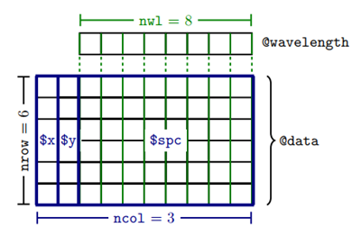

```{r setup, include=FALSE}
# Packages -------------------------------------------------------------------
library(hyperSpec)

# Functions ------------------------------------------------------------------
source("man/vignette-functions.R", encoding = "UTF-8")

# Settings -------------------------------------------------------------------
source("man/vignette-default-settingsR.R", encoding = "UTF-8")

# knitr::opts_chunk$set(
#   fig.path   = "man/figures/intro--"
# )

```

```{r bib, echo=FALSE, paged.print=FALSE}
make_bib(
  c("hyperSpec",
    "baseline",
    "compiler",
    "Rcpp",
    "inline",
    "mvtnorm",
    "plotrix",
    "pls"
  ),
  file = "man/intro-pkg.bib"
)
```


<!-- \SweaveOpts{concordance=TRUE} -->
<!-- \title{package **hyperSpec** Introduction } -->


> **Reproducing the Examples in this Vignette**  
> All spectra used in this manual are installed automatically with package **hyperSpec**.
> 

<!-- > Note that some definitions are executed in `vignette.defs`. -->


> **Reporting Issues and Suggesting Enhancements**
> `bug.report(package = "hyperSpec")`{.r} will take you to package **hyperSpec**'s issue tracking page at
<https://github.com/cbeleites/hyperSpec/issues> where you can report issues you encounter, suggest features and comment on issues or suggested features.


<!-- \tableofcontents -->

# Suggested Packages and Setup {-}

To build this vignette, some packages are suggested but not strictly needed:
<!-- latticeExtra -->

```{r check-required, echo=FALSE, results='tex', eval=FALSE}
check.req.pkg("pls", special = list(msc = function(x) {
  texterrormsg("msc", "pls")
  x
}))
check.req.pkg("baseline",
  special = list(
    baseline = function(x) {
      texterrormsg("baseline", "baseline")
      x
    },
    getCorrected = function(x) {
      texterrormsg("getCorrected", "baseline")
      x
    }
  )
)
check.req.pkg("ggplot2",  donothing = "")
check.req.pkg("compiler", donothing = "")
check.req.pkg("inline",   donothing = "")
```


```{r packages}
library(hyperSpec)

library(mvtnorm)
library(MASS)
library(plotrix)
library(pls)


par(mar = c(4.1, 4.1, 1, .6))

set.seed(2020)
```


# Introduction


Package **hyperSpec** is a R package that allows convenient handling of \index{hyperspectral data sets} hyperspectral data sets, i.e., data sets combining spectra with further data on a per-spectrum basis.
The spectra can be anything that is recorded over a common discretized axis.

This vignette gives an introduction on basic working techniques using the R package package **hyperSpec**. 
This is done mostly from a spectroscopic point of view: rather than going through the functions provided by
package **hyperSpec**, it is organized in spectroscopic tasks. 
However, the functions discussed are printed on the margin for a quick overview.

Package **hyperSpec** comes with five data sets: 
    
    
-----------------  ----------------------------------------------------------------------
**`chondro`**      \index{data sets!chondro}
                   A Raman map of chondrocytes in cartilage.

**`flu`**          \index{data sets!flu}
                   A set of fluorescence spectra of a calibration series.

**`laser`**        \index{data sets!laser}
                   A time series of an unstable laser emission.

**`paracetamol`**  \index{data sets!paracetamol}
                   A Raman spectrum of paracetamol (acetaminophene) ranging
                   from 100 to 3200 cm^-1^ with overlapping wavelength ranges.
                   
**`barbiturates`** \index{data sets!barbiturates}
                   GC-MS spectra with differing wavelength axes as a list of 
                   `r length(barbiturates)` `hyperSpec`{.r} objects.
-----------------  ----------------------------------------------------------------------

In this vignette, the data sets are used to illustrate appropriate procedures for different tasks and different spectra.
In addition, the first three data sets are accompanied by their own vignettes showing exemplary work flows for the respective data type.

This document describes how to accomplish typical tasks in the analysis of spectra.
It does not give a complete reference on particular functions. 
It is therefore recommended to look up the methods in **R**'s help system using `?command`{.r}.

```{r}
# FIXME: Is Appendix supported by Rmd? 
```
A complete list of the functions available in package **hyperSpec** is given in
appendix \@ref(tab:functions).

## Notation and Terms
Throughout the documentation of the package, the following terms are used:


**wavelength** \index{wavelength} 
: spectral abscissa  
frequency, wavenumbers, chemical shift, Raman shift, $\frac{m}{z}$, etc.

**intensity** \index{intensity}
: spectral ordinate  
transmission, absorbance, $\frac{e^{-}}{s}$, intensity, ...

**extra data** \index{extra data}
: further information/data belonging to each spectrum 
spatial information (spectral images, maps, or profiles), temporal information (kinetics, time series), concentrations (calibration  series), class membership information, etc.
Class `hyperSpec`{.r} object may contain arbitrary numbers of extra data columns.

In R, slots of an S4 class are accessed by the \index{`"@`{.r} operator}`@`{.r} operator. 
In this vignette, the notation `@xxx`{.r} will thus mean *"slot xxx of an objec"*. 
Likewise, named elements of a `list`{.r} and columns of a `data.frame`{.r} are accessed by the \index{`$`{.r} operator} `$`{.r} operator, and `$xxx`{.r} will be used for *"column xxx"*, and as an
abbreviation for *"column xxx of the `data.frame`{.r} in slot data of the objec"* (the structure of `hyperSpec`{.r} objects is discussed in section \@ref(sec:structure-chy)).


# Remarks on R

## Reporting an Issue with a package
**R** packages include contact information of the package maintainer, which you can
access e.g., by:

```{r}
maintainer("hyperSpec")
```

In case you want to report an issue, **R** provides a function to do so:
`bug.report()`{.r} will either open an email to the package maintainer or the issue tracker URL given in the package `DESCRIPTION`.

```{r eval=FALSE}
bug.report(package = "hyperSpec")
```
Will take you to package **hyperSpec**'s issue tracking page at <https://github.com/cbeleites/hyperSpec/issues>.
It also displays essential information about your installation which can help in tracking down the bug.

We're always happy about contributions and tag issues that may be tackled immediately by "Help wanted".
Please note that I (Claudia, the official maintainer) may be rather slow in answering pull requests: at the moment I'm travelig a lot professionally so it may take several weeks until I can find some calm chunk of time to do more for **hyperSpec** than emergency fixes.
However, this does not mean that I won't do so: I can tell quickly if a pull request won't fit at all into package **hyperSpec**.


## Generic Functions

\index{Generic Functions} *Generic Functions* are functions that apply to a wide range of data types or classes, e.g., `plot()`{.r}, `print()`{.r}, mathematical operators, etc. These functions can be implemented in a specialized way by each class.  
Package **hyperSpec** implements with a variety of such functions, see appendix \@ref(tab:functions).

```{r}
# FIXME:  Appendix is mentioned. Possible issue.
```

## Functionality Can be Extended at Runtime

**R**'s concept of functions offers much flexibility.
Functions may be added or changed by the user in his *workspace* at any time.
This is also true for methods belonging to a certain class.
Neither restart of R nor reloading of the package or anything the like is needed.
If the original function resides in a namespace (as it is the case for all functions in package **hyperSpec**), the original function is not deleted.
It is just masked by the user's new function but stays accessible via the `::`{.r} operator.

The same is true for "normal" variables: you may create changed copies of the example data sets, work with these and then "reset" to package **hyperSpec**'s version of the data set by removing the object in your workspace.

This offers the opportunity of easily writing specialized functions that are adapted to specific
tasks.
Package **hyperSpec**'s vignettes use this to set up special versions of the lattice graphics functions that are already wrapped in `print()`{.r} (see also [R FAQ: Why do lattice/trellis graphics not work?](http://cran.r-project.org/doc/FAQ/R-FAQ.html#Why-do-lattice_002ftrellis-graphics-not-work_003f)) and allow the code in the code chunks of the vignettes to be exactly what one would type during an interactive **R** session.
For the code, check the `vignettes.defs` file accompanying all package **hyperSpec** vignettes.


## Validity Checking

S4 classes have a mechanism to define and enforce that the data actually stored in the object is appropriate for this class.
In other words, there is a mechanism of \index{validity checking} *validity checking*.

The functions provided by package **hyperSpec** check the validity of `hyperSpec`{.r} objects at the beginning, and -- if the validity could be broken by inappropriate arguments -- also before leaving the function. 
\index{validObject|texttt}
\index{chk.hy|texttt} 
\mFun{validObject, chk.hy}

It is highly recommended to use validity checking also for user-defined functions.
In addition, non-generic functions should first ensure that the argument actually is a `hyperSpec`{.r} object.
The two tasks are accomplished by:

```{r eval=FALSE}
chk.hy(object)
validObject(object)
```

The first line checks whether `object`{.r} is a `hyperSpec`{.r} object, the second checks its validity.
Both functions return `TRUE`{.r} if the checks succeed, otherwise they raise an error and stop.


## Special Function Names {#sec:spec-funct-names}

### The Names of Operators {#sec:names-operators}

\index{operators}Operators such as `+`, `-`,`*`, `%%`, etc. are, in fact, functions in **R**.
Thus they can be handed over as arguments to other functions (particularly to the vectorization functions `*apply()`{.r}, `sweep()`{.r}, etc.).
In this case, the name of the function must be quoted: \`-\` is the recommended style (although `"-"` will often work as well), e.g.,:

```{r eval=FALSE}
sweep(flu, 2, mean, `-`)
```


These functions can also be called in a more function-like style (prefix notation):

```{r}
`+`(3, 5)
```


### Assignment Functions {#sec:assignment-functions}

\index{assignment functions} 
\index{<-@see assignment functions}
**R** allows the definition of functions that do an assignment (set some part of the object), such as:

```{r eval=FALSE}
wl(flu) <- new.wavelength.values
```

The actual name of the function is `wl<-` and must be quoted in order to avoid confusion with an assignment to variable `wl`: 
```{r eval=FALSE}
`wl<-`
```


# Loading the Package and Configuration {#sec:loading-package}

To \index{loading} load package **hyperSpec**, use \nopagebreak

```{r init}
library("hyperSpec")
```

\index{options|textbf}
\index{options!debuglevel}
\index{options!gc}
The global behaviour of package **hyperSpec** can be configured via options. 
The values of the options are retrieved with `hy.getOptions()`{.r} and `hy.getOption()`{.r}, and changed with `hy.setOptions()`{.r}.
Table \@ref(tab:options) gives an overview.

<!-- ----------------------------------------------------------------------- -->
: **(\#tab:options)** Package **hyperSpec**'s options.
  Please refer to the documentation of the respective functions for details about the effect of the options.
    
name  | default value (range)  | description | used by                                       
----- | :---:                  |-------------| -----    
`debuglevel`           | `0`{.r} (`1L`{.r}, `2L`{.r}) | Amount of debugging information produced | `spc.identify()`{.r}, `map.identify()`{.r}, `spc.rubberband()`{.r},<br> various file import functions.     
`gc`                   | `FALSE`{.r} | Triggers frequent calling of `gc()`{.r} | `read.ENVI()`{.r}, <br>\newline`new("hyperSpec")`{.r} 
`tolerance`            | `sqrt(.Machine$.double.eps)`{.r} | Tolerance for numerical comparisons   | File import functions (removing empty spectra), `normalize01()`{.r}
`wl.tolerance`         | `sqrt(.Machine$.double.eps)`{.r} | Tolerance for comparisons of the wavelength axis | `rbind()`{.r}, `rbind2()`{.r}, `bind("r", ...)`{.r}, `all.equal()`{.r}, `collapse()`{.r}
`file.remove.emptyspc` | `TRUE`{.r} | Automatic removing of empty spectra                         | File import functions, see `vignette("fileio")`{.r}
`file.keep.name`       | `TRUE`{.r} | Automatic recording of file name in column `filename`{.r}   | File import functions, see `vignette("fileio")`{.r}
`plot.spc.nmax`        | `25`{.r}   | Number of spectra to be plotted by default                  | `plotspc()`{.r}
`ggplot.spc.nmax`      | `10`{.r}   |                                                             | `qplotspc()`{.r}

<!-- ----------------------------------------------------------------------- -->


```{r checkCompleteOptionTable, echo=FALSE, results='hide'}
stopifnot(all(names(hy.getOptions(TRUE)) %in% c(
  "debuglevel", "gc", "file.remove.emptyspc",
  "file.keep.name", "tolerance", "wl.tolerance", "plot.spc.nmax", "ggplot.spc.nmax"
)))
```


# The Structure of `hyperSpec`{.r} Objects {#sec:structure-chy}

`hyperSpec`{.r} is an S4 (or new-style) class. 
Four slots contain the parts of the object:

-  **`@wavelength`{.r}** containing a numeric vector with the wavelength axis of the spectra.
-  **`@data`{.r}**       a `data.frame`{.r} with the spectra and all further information belonging to the spectra.
-  **`@label`{.r}**      a list with appropriate labels (particularly for axis annotations).

```{r}
# FIXME: "Four slots contain the parts..." only 3 slots are mentioned in the list!
```

<!-- --- -->

While the parts of the `hyperSpec`{.r} object can be accessed directly, it is good practice to use the functions provided by package **hyperSpec** to handle the objects rather than accessing the slots directly (Table \@ref(tab:getset)).
This also ensures that proper (*valid*) objects are returned.
In some cases, however, direct access to the slots can considerably speed up calculations (see section \@ref(sec:speed-considerations)).


<!-- ---------------------------------------------------------------------- -->
: **(\#tab:getset)** Get and set functions for the slots of `hyperSpec`{.r} objects

slot              | get                      | set
----------------- | ------------------------ | ------------------------ 
`@wavelength`{.r} | `wl()`{.r}               | `wl<-`{.r}
`@data`{.r}       | `[`, `[[`, `$`, `as.data.frame()`{.r}, `as.long.df()`{.r}, ... | `[<-`, `[[<-`, `$<-`
`@label`{.r}      | `labels()`{.r}           | `labels<-`{.r}
<!-- ---------------------------------------------------------------------- -->

Most of the data is stored in `@data`{.r}. This `data.frame`{.r} has one special column, `$spc`{.r}.
It is the column that actually contains the spectra. The spectra are stored in a matrix inside this column, as illustrated in figure \@ref(fig:structure). 
Even if there are no spectra, `$spc`{.r} must still be present.
It is then a matrix with zero columns.

```{r structure, echo=FALSE, fig.cap=CAPTION}

CAPTION = "The structure of the data in a `hyperSpec` object.  "
```


Slot `@label`{.r} contains an element for each of the columns in `@data`{.r} plus one holding the
label for the wavelength axis, `.wavelength`{.r}.
They are accessed by their names which must be the same for columns of `@data`{.r} and the list elements.
The elements of the list may be anything suitable for axis annotations, i.e., they should be either character strings or expressions for "pretty" axis annotations (see, e.g., figure \@ref(fig:loess-kl)).
To get familiar with expressions for axis annotation, see `?plotmath`{.r} and `demo(plotmath)`{.r}.


# Functions Provided by **hyperSpec** {#sec:funct-prov-phy}

```{r}
# FIXME: "appendix" is mentioned. Possible issue.
```
Table \@ref(tab:functions) in the appendix gives an overview of the functions implemented by package **hyperSpec**.


# Obtaining Basic Information about `hyperSpec`{.r} Objects {#info-hyperspec-objs}

```{r}
# FIXME: Output of print() and summary() is identical. Is it expected?
```

\mFun{print, show, summary}
As usual, the `print()`{.r} and `show()`{.r} methods display information about the object, and `summary()`{.r} yields some additional details about the data handling done so far:

```{r print}
chondro
```
```{r print-summary}
summary(chondro)
```

\mFun{nrow, ncol, nwl, dim}
The data set `chondro`{.r} consists of `r nrow(chondro)` spectra with `r nwl(chondro)` data points each, and `r ncol(chondro)` data columns: two for the spatial information, one factor with the results of a cluster analysis plus `$spc`{.r}. 
These information can be directly obtained by

```{r nwl}
nrow(chondro)
```
```{r nwl2}
nwl(chondro)
```
```{r nwl3}
ncol(chondro)
```
```{r nwl4}
dim(chondro)
```

\mFun{colnames, rownames, dimnames, wl}
The names of the columns in `@data`{.r} are accessed by `colnames()`{.r}.

```{r names}
colnames(chondro)
```

Likewise, `rownames()`{.r} returns the names assigned to the spectra, and `dimnames()`{.r} yields a list of these three vectors (including also the column names of `$spc`{.r}).
The column names of the spectra matrix contain the wavelengths as character, while `wl()`{.r} (see section \@ref(sec:wavel-axis-conv)) yields the numeric vector of wavelengths.

\mFun{colnames<-, rownames<-}
Extra data column names and rownames of the object may be set by `colnames<-`{.r} and `rownames<-`{.r}, respectively.
Function `colnames<-`{.r} renames the labels as well.


# Creating a `hyperSpec`{.r} Object, Data Import and Export {#sec:create}

Package **hyperSpec** comes with filters for a variety of file formats.
These are discussed in detail in a separate vignette accessible via `vignette("fileio")`.


## Creating a `hyperSpec`{.r} Object from Spectra Matrix and Wavelength Vector

If the data is in R's workspace, a `hyperSpec`{.r} object is created by:

```{r eval=FALSE}
spc <- new("hyperSpec", spc = spectra.matrix, wavelength = wavelength.vector, data = extra.data)
```

The most frequently needed arguments are:

-------------------- ---------------------------------------------------------------------------------
**`spc`{.r}**        The spectra matrix.

**`wavelength`{.r}** The wavelength axis vector.

**`data`{.r}**       The extra data (can already contain the spectra matrix in column `$spc`{.r}).

**`label`{.r}**      A list with the proper labels.
                     Do not forget the wavelength axis label in  `$.wavelength`{.r} and the
                     spectral intensity axis label in `$spc`{.r}.
-------------------- ---------------------------------------------------------------------------------

More information about converting existing data into `hyperSpec`{.r} objects can be found in `vignette ("fileio")`{.r}.


## Creating Random Spectra

\mFun{rmmvnorm}
If package **mvtnorm**`r cite_pkg("mvtnorm")` is available, multivariate normally distributed spectra can be generated from mean and covariance matrix using `rmmvnorm()`{.r} (Fig. \@ref(fig:sim-spc)). 
Note that the package **hyperSpec** function's name has an additional "m": it already takes care of multiple groups.
Mean spectra and pooled covariance matrix can be calculated using `pooled.cov()`{.r}\mFun{pooled.cov}:

```{r}
pcov <- pooled.cov(chondro, chondro$clusters) 
rnd  <- rmmvnorm(rep(10, 3), mean = pcov$mean, sigma = pcov$COV)
```


```{r include=FALSE}
CAPTION <- "Multivariate normally distributed random spectra generated with `rmmvnorm()`{.r}."
```
<!-- , fig.width=10, fig.height=5 -->
```{r sim-spc, fig.cap=CAPTION}
cluster.cols <- c("dark blue", "orange", "#C02020")
plot(rnd, col = cluster.cols[rnd$.group])
```

<!-- \begin{figure}[t] -->
<!-- \subfloat[ {#fig:sim:spc} `rmmvnorm()`{.r}]{\includegraphics[width=.66\linewidth]{hyperspec-fig-simspc}} -->
<!-- \subfloat[ {#fig:sim:lda} LDA of simulated spectra. Crosses mark real spectra.]{\includegraphics[width=.33\linewidth]{hyperspec-fig-simlda}} -->
<!--   \caption{Multivariate normally distributed random spectra.} -->
<!--    {#fig:sim} -->
<!-- \end{figure} -->

Fig. \@ref(fig:sim-lda) shows the linear discriminant analysis (LDA) scores of such  simulated specta in comparison to the real spectra in the `chondro`{.r} object:


```{r lda}
library("MASS")

rnd <- rmmvnorm(rep(200, 3), mean = pcov$mean, sigma = pcov$COV)
lda <- lda(clusters ~ spc, rnd)

pred.chondro <- predict(lda, newdata = chondro)
pred.sim <- predict(lda)
```


```{r}
# FIXME: 
# pred.chondro <- predict(lda, newdata = chondro)
# #> Warning in predict.lda(lda, chondro): variable names in 'newdata' do not match those in 'object'
```

```{r include=FALSE}
CAPTION <- "LDA of simulated spectra. Crosses mark real spectra. "
```
<!-- , width=5, fig.height=5 -->
```{r sim-lda, fig.cap=CAPTION}
colors <- c("#00008040", "#FFA50040", "#C0202040")
plot(pred.chondro$x, col = colors[chondro$clusters], pch = 3)
points(pred.sim$x,   col = colors[rnd$clusters], pch = 20, cex = 0.5)
```

If individual covariance matrices should be used for each group, `sigma`{.r} should be an array with the 3rd dimension corresponding to the group.


# Access to the data {#sec:access-parts}

The main functions to retrieve the data of a `hyperSpec`{.r} object are `[]` and `[[]]`. \mFun{`[]`,`[[]]`}
The difference between these functions is that `[]` returns a `hyperSpec`{.r} object, whereas the result of `[[]]` is a `data.frame`{.r} if extra data columns were selected or otherwise the spectra matrix.
Single extra data columns may be retrieved by `$`{.r}. \mFun{`$`{.r}}

\mFun{`[]<-`, `[[]]<-`, `$<-`} 
In order to change data, use `[]<-`, `[[]]<-`, and `$<-` (see \@ref(sec:square-brack-replace) and \@ref(sec:accessing-extra-data)).


## Access Functions and Abbreviations for Parts of the `hyperSpec`{.r} Object's Data {#sec:fast-access-parts}

\mFun{`[] [[]] $. $.. []<- [[]]<- $<-`}
Class `hyperSpec`{.r} comes with three abbreviation functions for easy access to the data:
 
------------------------ -----------------------------------------------------------------------------------------------------------------------
**`x[[]]`{.r}**          Returns the spectra matrix (`x$spc`{.r}).
**`x[[i, , l]]`{.r}**    The cut spectra matrix is returned if wavelengths are specified in `l`{.r}.
**`x[[i, j, l]]`{.r}**   If data columns are selected (second index), the result is a `data.frame`{.r}.
**`x[[i, , l]] <-`{.r}** Also, parts of the spectra matrix can be set (only indices for spectra and wavelength are allowed for this function).
**`x[i, j] <-`{.r}**     Sets parts of `x@data`{.r}.
**`x$.`{.r}**            Returns the complete `data.frame`{.r} `x@data`{.r}, with the spectra in column `$spc`{.r}.
**`x$..`{.r}**           Returns the extra data (`x@data`{.r} without `x$spc`{.r}).
**`x$.. <-`{.r}**        Sets the extra data (`x@data`{.r} without `x$spc`{.r}). The columns must match exactly in this case.
------------------------ -----------------------------------------------------------------------------------------------------------------------


## Selecting and Deleting Spectra {#sec:select-delete-spectra}

The extraction function `[]` takes the spectra as first argument (For detailed help: see `?"["`{.r}).
It may be a vector giving the indices of the spectra to extract (select), a vector with negative indices indicating, which spectra should be deleted, or a vector of logical values.
Note that a matrix given to `[]` will be treated as a vector.


```{r include=FALSE}
CAPTION <- "An example with `[]` operator and positive indices.  "
```

```{r selspc, fig.cap=CAPTION}
plot(flu, col = "green2")
plot(flu[1:3], add = TRUE)
```


```{r include=FALSE}
CAPTION <- "An example with `[]` operator and negative indices.  "
```

```{r delspc, fig.cap=CAPTION}
plot(flu, col = "red")
plot(flu[-3], add = TRUE)
```


```{r include=FALSE}
CAPTION <- "An example with `[]` operator and logical indices.  "
```

```{r selspc2, fig.cap=CAPTION}
plot(flu, col = "gold")
plot(flu[flu$c > 0.2], add = TRUE)
```


### Random Samples {#sec:random-samples}

\mFun{`sample()`{.r}}
A random subset of spectra is conveniently selected by `sample()`{.r}:

```{r sample}
sample(chondro, 3)
```

\mFun{`isample()`{.r}}
If appropriate indices into the spectra are needed instead, use `isample()`{.r}:

```{r isample}
isample(chondro, 3)
```


### Sequences {#sec:seq}

\mFun{`seq()`{.r}}
Sequences of every n^th^ spectrum or the like can be retrieved with `seq()`{.r}:

```{r seq}
seq(chondro, length.out = 3, index = TRUE)
seq(chondro, by = 100)
```
Here, indices may be requested using `index = TRUE`{.r}.


## Selecting Extra Data Columns  {#sec:accessing-extra-data}

The second argument of the extraction functions `[]` and `[[]]` specifies the (extra) data columns.
They can be given like any column specification for a `data.frame`{.r}, i.e., numeric, logical, or by a vector of the column names:

```{r data}
colnames(chondro)
```
```{r data-chondro-b}
chondro[[1:3, 1]]
```
```{r data-chondro-c}
chondro[[1:3, -5]]
```
```{r data-chondro-d}
chondro[[1:3, "x"]]
```
```{r data-chondro-e}
chondro[[1:3, c(FALSE, TRUE)]] # note the recycling!
```

\mFun{`$`{.r}}
To select one column, the `$`{.r} operator is more convenient:

```{r data2}
flu$c
```

Class `hyperSpec`{.r} supports command line completion for the `$`{.r} operator.

\mFun{`$<-`{.r}}
The extra data may also be set this way:

```{r data3}
flu$n <- list(1:6, label = "sample no.")
```

This function will append new columns, if necessary.


## More on the `[[]]` and `[[]]<-` {#double-square-brackets}

### Operators: Accessing Single Elements of the Spectra Matrix {#sec:square-brack-replace}

Operator `[[]]` works mostly analogous to `[]`.
In addition, however, these two functions also accept index matrices of size $n × 2$. 
In this case, a vector of values from the spectra matrix is returned.

```{r data4}
indexmatrix <- matrix(c(1:3, 1:3), ncol = 2)
indexmatrix
```

```{r data4b}
chondro[[indexmatrix, wl.index = TRUE]]
```

```{r data4c}
diag(chondro[[1:3, , min ~ min + 2i]])
```

Operator `[[]]<-` also accepts index matrices of size $n × 2$.


## Wavelengths {#sec:wavelength-axis}

\index{wavelength!formula notation}
\index{wavelength!conversion to index}
\index{wavelength indices!conversion to wavelength}


### Converting Wavelengths to Indices and vice versa {#sec:wavelength-indices}

\mFun{`wl2i()`{.r} `i2wl()`{.r}}
Spectra in package **hyperSpec** have always discretized wavelength axes, they are stored in a matrix with each column corresponding to one wavelength. 
Package **hyperSpec** provides two functions to convert the respective column indices into wavelengths and vice versa: `i2wl()`{.r} and `wl2i()`{.r}.

If the wavelengths are given as a numeric vector, they are each converted to the corresponding wavelength. 
In addition there is a more sophisticated possibility of specifying wavelength ranges using a *formula*.
The basic syntax is **`start ~ end`**.
This yields a vector **`index_of_start : index_of_end`**.

The result of the formula conversion differs from the numeric vector conversion in three ways:

-  The colon operator for constructing vectors accepts only integer numbers, the tilde (for   formulas) does not have this restriction.
-  If the vector does not take into account the spectral resolution, one may get only every $n$^th^ point or repetitions of the same index:

```{r wl2ivec}
wl2i(flu, 405:410)
```

```{r wl2ivec2}
wl2i(flu, 405 ~ 410)
```

```{r wl2ivec3}
wl2i(chondro, 1000:1010)
```

```{r wl2ivec4}
wl2i(chondro, 1000 ~ 1010)
```
-  If the object's wavelength axis is not ordered, the formula approach will give weird
  results. In that (probably rare) case, use `orderwl()`{.r} first to obtain an object with
  ordered wavelength axis.

Values *start* and *end* may contain the special variables `min`{.r} and `max`{.r} that
correspond to the lowest and highest wavelengths of the object:

```{r wl2i.minmax}
wl2i(flu, min ~ 410)
```

Often, specifications like *"wavelength $pm n$ data points"* are needed.
They can be given using complex numbers in the formula.
The imaginary part is added to the index calculated from the wavelength in the real part:

```{r wl2i.im}
wl2i(flu, 450 - 2i ~ 450 + 2i)
wl2i(flu, max - 2i ~ max)
```

To specify several wavelength ranges, use a list containing the formulas and vectors^[Formulas are combined to a list by `c()`{.r}.]:

```{r wl2i.list}
wl2i(flu, c(min ~ 406.5, max - 2i ~ max))
```

This mechanism also works for the wavelength arguments of `[]`, `[[]]`, and `plotspc()`{.r}.


### Selecting Wavelength Ranges

Wavelength ranges can easily be selected using `[]`'s third argument (Fig. \@ref(fig:paracetamol)).

```{r include=FALSE}
CAPTION <- "Spectra of `paracetamol` in range of 2800--3200 cm^-1^."
```

```{r paracetamol, fig.cap=CAPTION}
plot(paracetamol[, , 2800 ~ 3200])
```

By default, the values given are treated as wavelengths. 
If they are indices into the columns of the spectra matrix, use `wl.index = TRUE`{.r}:


```{r include=FALSE}
CAPTION <- "Spectra of `paracetamol`: from 2800^th^ to 3200^th^ point on *wavelength* axis.  "
```

```{r fig.cap=CAPTION}
plot(paracetamol[, , 2800:3200, wl.index = TRUE])
```

Section \@ref(sec:wavelength-indices) delves into the different possibilities of specifying wavelengths.


### Deleting Wavelength Ranges {#sec:del-wavelengths}

Deleting wavelength ranges may be accomplished using negative index vectors together with `wl.index = TRUE`{.r}.


```{r include=FALSE}
CAPTION <- "Spectra of `paracetamol` with 500^th^ to 1000^th^ *wavelength* axis point removed.  "
```

```{r fig.cap=CAPTION}
plot(paracetamol[, , -(500:1000), wl.index = TRUE])
```

However, this mechanism works only if the proper indices are known.

If the range to be cut out is rather known in the units of the wavelength axis, it is easier to select the remainder of the spectrum instead.
To delete the spectral range from 1750 to 2800 cm^-1^ of the paracetamol spectrum one can thus use:


```{r include=FALSE}
CAPTION <- "Spectra of `paracetamol` with range from 1750 to 2800 cm^-1^ removed.  "
```

```{r fig.cap=CAPTION}
plot(paracetamol[, , c(min ~ 1750, 2800 ~ max)])
```

(It is possible to produce a plot of this data where the cut range is actually omitted and the
wavelength axis is optionally cut in order to save space.
For details see the "Plotting" vignette).


### Changing the Wavelength Axis {#sec:wavel-axis-conv}

\index{wavelength!conversion} 
\mFun{`wl()`{.r}, `wl<-`{.r}}
Sometimes wavelength axes need to be transformed, e.g., converting from wavelengths to frequencies. 
In this case, retrieve the wavelength axis vector with `wl()`{.r}, convert each value of the resulting vector and assign the result with `wl<-`{.r}.
Also the label of the wavelength axis may need to be adjusted.

As an example, convert the wavelength axis of `laser`{.r} to frequencies.
As the wavelengths are in nanometers, and the frequencies are easiest expressed in terahertz, an additional conversion factor of 1000 is needed:

```{r laser}
laser
```
```{r merged}
wavelengths <- wl(laser)
frequencies <- 2.998e8 / wavelengths / 1000
wl(laser) <- frequencies
labels(laser, ".wavelength") <- "f / THz"
laser
rm(laser)
```

There are other possibilities of invoking `wl<-`{.r} including the new label, e.g.,

```{r}
wl(laser, "f / THz") <- frequencies
```
and

```{r}
wl(laser) <- list(wl = frequencies, label = "f / THz")
```
see `?wl<-` for more information.


### Ordering the Wavelength Axis {#sec:orderwl}

\mFun{`orderwl()`{.r}}
If the wavelength axis of an object needs reordering (e.g., after `collapse()`{.r}), `orderwl()`{.r} can be used:

```{r orderwl}
barb <- collapse(barbiturates[1:3])
wl(barb)
```

```{r orderwl-2}
barb <- orderwl(barb)
wl(barb)
```


## Conversion to Long- and Wide-Format `data.frame`{.r}s {#sec:conv-long-form}

\mFun{`as.data.frame()`{.r}}
Function `as.data.frame()`{.r} extracts the `@data`{.r} slot as a `data.frame`{.r}:

```{r}
flu <- flu[, , 400 ~ 407] # make a small and handy version of the flu data set
as.data.frame(flu)
```
```{r}
colnames(as.data.frame(flu))
```
```{r}
as.data.frame(flu)$spc
```
Note that the spectra matrix is still a matrix inside column `$spc`{.r}.

\mFun{`$.`{.r}, `$..`{.r}}
Function `as.data.frame()`{.r} and the abbreviations `$.`{.r} and `$..`{.r} retrieve the usual wide format `data.frame`{.r}s:

```{r}
flu$.
```
```{r}
flu$..
```
\mFun{`[[]]`}
If another subset of colums needs to be extracted, use `[[]]`:

```{r}
flu[[, c("c", "spc")]]
```

This can be combined with extracting certain spectra and wavelengths, see below in subsection"nameref{sec:conv-matrix"on page \pageref{sec:conv-matrix}.

\mFun{`as.t.df()`{.r}}
The transpose of a wide format `data.frame`{.r} can be obtained by `as.t.df()`{.r}. For further examples, see the discussion of package **ggplot2** in `vignette("plotting")`{.r}.

```{r}
as.t.df(apply(flu, 2, mean_pm_sd))
```

\mFun{`as.long.df()`{.r}}
Some functions need the data being an *unstacked* or *long-format* `data.frame`{.r}.
Function `as.long.df()`{.r} is the appropriate conversion function.

```{r}
head(as.long.df(flu), 20)
```

## Conversion to Matrix {#sec:conv-matrix}

\mFun{`as.matrix()`{.r}, `[[]]`} 
The spectra matrix is extracted by `as.matrix()`{.r}, the convenient abbreviation is `[[]]`:

```{r}
flu[[]]
```
```{r}
class(flu[[]])
```
Operator `[[]]` takes the same arguments as `[]`, and can be used to extract a matrix containing parts of the spectra matrix:

```{r}
flu[[1:3, , 406 ~ 407]]
```
If indices for the columns to extract are given, a `data.frame`{.r} is returned instead of a matrix:

```{r}
flu[[1:3, c("filename", "spc"), 406 ~ 407]]
```

```{r}
rm(flu)
```


# Combining and Decomposing `hyperSpec`{.r} Objects {#sec:combine}

## Binding Objects together {#sec:bind}

\mFun{`cbind()`{.r} `rbind()`{.r}}
Class `hyperspec`{.r} objects can be bound together, either by columns (`cbind()`{.r}) to append a new spectral range or by row (`rbind()`{.r}) to append new spectra:

```{r cbind}
dim(flu)
```
```{r}
dim(cbind(flu, flu))
```
```{r}
dim(rbind(flu, flu))
```

There is also a more general function, `bind()`{.r}, taking the direction (`"r"`{.r} or `"c"`{.r}) as first argument followed by the objects to bind either in separate arguments or in a list.

```{r}
# FIXME: the sentence "must have the same rows and columns, respectively." seems 
#        to be confusing and should be fixed.
#        
# Maybe: "the same column names" or "the same number of columns (for 
#        `rbind()`{.r}) and the same number of rows (for `cbind()`{.r})"?
```

As usual for `rbind()`{.r} and `cbind()`{.r}, the objects that should be bound together must
have the same rows and columns, respectively.

\mFun{`collapse()`{.r}}
For binding row-wise (`rbind()`{.r}), `collapse()`{.r} is more flexible but also faster.
```{r}
# FIXME: I think, "but" is an incorrect preposition:
#        "is more flexible BUT also faster". 
# 
# Maybe: "not only is more flexible but also faster" or
#        "is more flexible as well as faster"
```

## Binding Objects that do not Share the Same Extra Data and/or Wavelength Axis {#sec:collapse}

\mFun{`collapse()`{.r}}
Function `collapse()`{.r} combines objects that should be bound together by row, but they do not share the columns and/or spectral range. 
The resulting object has all columns from all input objects, and all wavelengths from the input objects. 
If an input object does not have a particular column or wavelength, its value in the resulting object is `NA`{.r}.

The `barbiturates`{.r} data is a list of `r length(barbiturates)` `hyperSpec`{.r} objects, each containing one mass spectrum.
The spectra have between `r (min(sapply(barbiturates, nwl)))` and `r (max(sapply(barbiturates, nwl)))` data points each.

```{r collapse}
barb <- collapse(barbiturates)
wl(barb)[1:25]
```
The resulting object does not have an ordered wavelength axis.
This can be obtained in the second step:

```{r collapse-orderwl}
barb <- orderwl(barb)
barb[[1:3, , min ~ min + 10i]]
```


## Binding Objects that do not Share the Same Spectra {#sec:merge}

\mFun{`merge()`{.r}} 
Function `merge()`{.r} adds a new spectral range (like `cbind()`{.r}), but works also if spectra are missing in one of the objects.
The arguments `by`{.r}, `by.x`{.r}, and `by.y`{.r} specify which columns should be used to decide which spectra are the same.
The arguments `all`{.r}, `all.x`{.r}, and `all.y`{.r} determine whether spectra should be kept for the result set if they appear in only one of the objects.
For details, see also the help on the base function `merge()`{.r}.

As an example, let's construct a version of the `chondro`{.r} data like being taken as two maps with different spectral ranges.
In each data set, some spectra are missing.

```{r merge-sample}
chondro.low <- sample(chondro[, , 600 ~ 1200], 700)
nrow(chondro.low)
```
```{r merge-sample-2}
chondro.high <- sample(chondro[, , 1400 ~ 1800], 700)
nrow(chondro.high)
```

As all extra data columns are the same, no special declarations are needed for merging the data:

```{r merge}
chondro.merged <- merge(chondro.low, chondro.high)
nrow(chondro.merged)
```

By default, the result consists of only those spectra, where *both* spectral ranges were available.
To keep all spectra replacing missing parts by `NA`{.r} (see Fig. \@ref(fig:merge-map), \@ref(fig:merge-mat)):

```{r}
chondro.merged <- merge(chondro.low, chondro.high, all = TRUE)
nrow(chondro.merged)
```


```{r include=FALSE}
CAPTION <- "For both spectral ranges some spectra are missing. "
```
<!-- , fig.width=10, fig.height=4.25 -->
```{r merge-map, fig.cap=CAPTION, fig.width=7}
levelplot(spc ~ x * y | as.factor(paste(.wavelength, "  1/cm")),
  chondro.merged[, , c(1000, 1650)],
  aspect = "iso", col.regions = matlab.palette()
)
```


<!-- ```{r merge-mat echo=FALSE, results='hide'} -->
<!-- png("hyperspec-fig-merged.png", width = 500, height = 425, res = 100) -->
<!-- plot(chondro.merged[1:100], "mat") -->
<!-- dev.off() -->
<!-- rm(chondro) -->
<!-- ``` -->

```{r include=FALSE}
CAPTION <- "The missing parts of the spectra are filled with `NA`{.r}.  "
```
```{r merge-mat, fig.cap=CAPTION}
plot(chondro.merged[1:100], "mat")
```


```{r}
merged <- merge(chondro[1:7, , 610 ~ 620], chondro[5:10, , 615 ~ 625], all = TRUE)
merged$.
```

If the spectra overlap, the result will have both data points. 
In the example here one could easily delete duplicate wavelengths. 
For real data, however, the duplicated wavelength will hardly ever contain the same values. 
The appropriate method to deal with this situation depends on the data at hand, but it will usually be some kind of spectral interpolation.

One possibility is removing duplicated wavelengths by using the mean intensity. 
This can conveniently be done by using `approx()`{.r} using `method = "constant"`{.r}. 
For duplicated wavelengths, the intensities will be combined by the tie function. 
This already defaults to the mean, but we need `na.rm = TRUE`{.r}.

Thus, the function to calculate the new spectral intensities is

```{r approxfun}
approxfun <- function(y, wl, new.wl) {
  approx(wl, y, new.wl,
    method = "constant",
    ties = function(x) mean(x, na.rm = TRUE)
  )$y
}
```

which can be applied to the spectra:

```{r}
merged <- apply(merged, 1, approxfun,
  wl = wl(merged),
  new.wl = unique(wl(merged)),
  new.wavelength = "new.wl"
)
merged$.
```

## Merging extra data to objects that do not (necessarily) share the same spectra {#sec:merge-df}

Assume we obtained duplicate reference measurements for some of the concentrations in `flu`{.r}:

```{r}
flu.ref <- data.frame(
  filename = rep(flu$filename[1:2], each = 2), 
  cref     = rep(flu$c[1:2], each = 2) + rnorm(4, sd = 0.01)
)
flu.ref
```

This information can be merged into the extra data of `flu`{.r} by:

```{r}
flu.merged <- merge(flu, flu.ref)
flu.merged$..
```

The usual rules for `merge()`{.r} apply.
E. g., if to preserver all spectra of flu, use `all.x = TRUE`{.r}:

```{r}
flu.merged <- merge(flu, flu.ref, all.x = TRUE)
flu.merged$..
```

The class of the first object (`x`{.r}) determines the resulting class:

```{r}
class(merge(flu, flu.ref))
```
```{r}
class(merge(flu.ref, flu))
```


## Matrix Multiplication {#sec:matmult}

\mFun{`\%*\%`}
Two `hyperSpec`{.r} objects can be matrix multiplied by `%*%`{.r}.
For an example, see the principal component analysis below (section \@ref(sec:pca)).


## Decomposition {#sec:decomposition}

Matrix decompositions are common operations during chemometric data analysis.
The results, e.g., of a principal component analysis are two matrices, the so-called scores and loadings. 
The results can have either the same number of rows as the spectra matrix they were calculated from (scores-like), or
they have as many wavelengths as the spectra (loadings-like).

\mFun{`decomposition()`{.r}}
Both types of result objects can be "re-imported" into `hyperSpec`{.r} objects with function `decomposition()`{.r}.
A scores-like object retains all per-spectrum information (i.e., the extra data) while the spectra matrix and wavelength vector are replaced. 
A loadings-like object retains the wavelength information, while extra data is deleted (set to `NA`{.r}) unless the value is constant for all spectra.

A demonstration can be found in the principal component analysis example (section \@ref(sec:pca)).


# Plotting

Package **hyperSpec** offers a variety of possibilities to plot spectra, spectral maps, the spectra matrix, time
series, depth profiles, etc. 
This all is discussed in a separate document: see `vignette ("plotting")`.


# Spectral (Pre)processing

## Cutting the Spectral Range

\mFun{`[]` `[[]]`}
The extraction operators `[]` and `[[]]` can be used to cut the spectra.
Their third argument takes wavelength specifications as discussed above and also logicals (i.e. vectors specifying with `TRUE`{.r}/`FALSE`{.r} for each column of `$spc`{.r} whether it should be included or not.

Operator`[]` returns a `hyperSpec`{.r} object, `[[]]` the spectra matrix `$spc`{.r} (or the `data.frame`{.r} `@data`{.r} if in addition data columns were specified) only.

```{r cut.wl}
flu[, , min ~ 408.5]
flu[[, , c(min ~ min + 2i, max - 2i ~ max)]]
```


## Shifting Spectra {#sec:shifting-spectra}

Sometimes, spectra need to be aligned along the spectral axis.

In general, two options are available for shifting spectra along the wavelength axis.

1.  The wavelength axis can be shifted, while the intensities stay unaffected.
2.  The spectra are interpolated onto a new wavelength axis, while the nominal wavelengths stay.


The first method is very straightforward (Fig. \@ref(fig:shift-wl)):


```{r}
tmp <- chondro
wl(tmp) <- wl(tmp) - 10
```


```{r include=FALSE}
CAPTION <- 
"Shifting the spectra along the wavelength axis: changing the wavelength values.  "
```

```{r shift-wl, fig.cap=CAPTION}
plot(chondro[135])
plot(tmp[135, , ], add = TRUE, col = "red")
```

But the method cannot be used if each spectrum (or groups of spectra) are shifted individually.
In that case, interpolation is needed.
**R** offers many possibilities to interpolate (e.g., `approx()`{.r} for constant / linear approximation, `spline()`{.r} for spline interpolation, `loess()`{.r} can be used to obtain smoothed approximations, etc.).
The appropriate interpolation strategy will depend on the spectra, and package **hyperSpec** therefore leaves it up to the user to select a sensible interpolation function.

As an example, we will use natural splines to do the interpolation.
It is convenient to set it up as a function:

```{r fun-interpolate}
interpolate <- function(spc, shift, wl) {
  spline(wl + shift, spc, xout = wl, method = "natural")$y
}
```

This function can now be applied to a set of spectra (Fig. \@ref(fig:shift-interp)):

```{r}
tmp <- apply(chondro, 1, interpolate, shift = -10, wl = wl(chondro))
```


```{r include=FALSE}
CAPTION <- "Shifting the spectra along the wavelength axis: interpolation.  "
```

```{r shift-interp, fig.cap=CAPTION, results='hide'}
plot(chondro[135])
plot(tmp[135], add = TRUE, col = "red")
```

Fig. \@ref(fig:shift-untsch) demonstrates the difference between simple shifting and interpolation.

```{r include=FALSE}
CAPTION <- "Shifting the spectra along the wavelength axis. 
Detail view of the phenylalanine band: shifting by `wl<-`{.r} (red) does not affect the intensities, while the spectrum is slightly changed by interpolations (blue).  "
```

```{r shift-untsch, fig.cap=CAPTION, results='hide'}
tmp <- chondro[135, , 990 ~ 1010]
plot(tmp, lines.args = list(type = "b", pch = 19, cex = 0.5))
wl(tmp) <- wl(tmp) - 0.5
plot(tmp, lines.args = list(type = "b", pch = 19, cex = 0.5), add = TRUE, col = "red")

tmp <- chondro[135]
tmp <- apply(tmp, 1, function(x, wl, shift) {
  spline(wl + shift, x, xout = wl)$y
},
  wl = wl(tmp), shift = -0.5
)
plot(tmp, lines.args = list(type = "b", pch = 19, cex = 0.5), add = TRUE, col = "blue")
```

If different spectra need to be offset by different shift, use a loop^[Function `sweep()`{.r} cannot be used here, and while there is the possibility to use sapply or mapply, they are not faster than the for loop in this case. Make sure to work on a copy of the spectra matrix, as that is much faster than row-wise extracting and changing the spectra by `[[()`{.r} and `[[<-`{.r}.].

```{r}
shifts <- rnorm(nrow(chondro))
tmp <- chondro[[]]
for (i in seq_len(nrow(chondro))) {
  tmp[i, ] <- interpolate(tmp[i, ], shifts[i], wl = wl(chondro))
}
chondro[[]] <- tmp
```


### Calculating the Shift {#sec:calculating-shift}

Often, the shift in the spectra is determined by aligning a particular signal.
This strategy works best with spectrally oversampled data that allows accurate determination of the signal position.

For the `chondro`{.r} data, let's use the maximum of the phenylalanine band between 990 and 1020 cm^-1^.
As just the very maximum is too coarse, we'll use the maximum of a square polynomial fitted to the maximum and its two neighbours.

```{r TODO-1}
#  TODO: use vanderMonde
```

```{r}
find.max <- function(y, x) {
  pos <- which.max(y) + (-1:1)
  X <- x[pos] - x[pos[2]]
  Y <- y[pos] - y[pos[2]]

  X <- cbind(1, X, X^2)
  coef <- qr.solve(X, Y)
  
  - coef[2] / coef[3] / 2 + x[pos[2]]
}

bandpos <- apply(chondro[[, , 990 ~ 1020]], 1, find.max, wl(chondro[, , 990 ~ 1020]))
refpos <- find.max(colMeans(chondro[[, , 990 ~ 1020]]),  wl(chondro[, , 990 ~ 1020]))

shift1 <- refpos - bandpos
```


A second possibility is to optimize the shift. 
For this strategy, the spectra must be sufficiently similar, while low spectral resolution is compensated by using larger spectral windows.

```{r}
chondro <- chondro - spc.fit.poly.below(chondro[, , min + 3i ~ max - 3i], chondro)
chondro <- sweep(chondro, 1, rowMeans(chondro[[]], na.rm = TRUE), "/")
```


```{r}
targetfn <- function(shift, wl, spc, targetspc) {
  error <- spline(wl + shift, spc, xout = wl)$y - targetspc
  sum(error^2)
}

shift2 <- numeric(nrow(chondro))
tmp <- chondro[[]]
target <- colMeans(chondro[[]])
for (i in 1:nrow(chondro)) {
  shift2[i] <- unlist(optimize(targetfn,
    interval = c(-5, 5), 
    wl = chondro@wavelength,
    spc = tmp[i, ], targetspc = target
  )$minimum)
}
```

Figure \@ref(fig:fit-shift) shows that the second correction method works better for the chondrocyte data. 
This was expected, as the spectra are hardly or not oversampled, but are very similar to each other.


```{r include=FALSE}
CAPTION <- "The shifts used to disturb the chondrocyte data (original), and the remaining shift after correction with the two methods discussed here.  "
```

```{r fit-shift, fig.cap=CAPTION, fig.width=7}
df <- data.frame(
  shift = c(shifts, shifts + shift1, shifts + shift2),
  method = rep(c("original", "find maximum", "interpolation"),
    each = nrow(chondro)
  )
)
plot(histogram(~ shift | method,
  data = df, breaks = do.breaks(range(df$shift), 25),
  layout = c(3, 1)
))
```


## Removing Bad Data

### Bad Spectra {#sec:bad-spectra}

Occasionally, one may want to remove spectra because of too low or too high signal.
E.g., for infrared spectra one may state that the absorbance maximum should be, say, between 0.1 and 1. 
Class `hyperSpec`{.r}'s comparison operators return a logical matrix of the size of the spectra that is suitable for later indexing:

```{r eval=FALSE}
ir.spc   <- chondro / 1500 ## fake IR data
high.int <- apply(ir.spc > 1, 1, any) # any point above 1 is bad
low.int  <- apply(ir.spc, 1, max) < 0.1 # the maximum should be at least 0.1
ir.spc   <- ir.spc [!high.int & !low.int]
```

### Removing Spectra outside mean $\pm$ $n$ sd

```{r}
mean_sd_filter <- function(x, n = 5) {
  x <- x - mean(x)
  s <- n * sd(x)
  (x <= s) & (x > -s)
}

OK <- apply(chondro[[]], 2, mean_sd_filter, n = 4) # logical matrix

spc.OK <- chondro[apply(OK, 1, all)]
```


```{r include=FALSE}
CAPTION <- "Filtering data: mean $\\pm$ sd filter.  "
```
<!-- , fig.width=10, fig.height=5 -->
```{r filter, fig.cap=CAPTION, fig.width=7}
plot(chondro[!apply(OK, 1, all)])
i <- which(!OK, arr.ind = TRUE)
points(wl(chondro)[i[, 2]], chondro[[!OK]], pch = 19, col = "red", cex = 0.5)
```

<!-- \begin{figure}[tb] -->
<!--   \subfloat[]{\includegraphics[width=0.49\textwidth]{hyperspec-fig-filter}} -->
<!--   \subfloat[remove bad points]{\includegraphics[width=0.49\textwidth]{hyperspec-fig-bad}} -->
<!--   \caption{filtering data} -->
<!--    {#fig:filter} -->
<!-- \end{figure} -->


### Bad Data Points {#sec:bad-data-points}

Assume the data contains once in a while a detector readout of 0:

```{r}
spc <- chondro[1:3, , min ~ min + 15i]
spc[[cbind(1:3, sample(nwl(spc), 3)), wl.index = TRUE]] <- 0
spc[[]]
```

We can set these points to `NA`{.r}, again using that the comparison returns a suitable logical matrix:

```{r}
spc[[spc < 1e-4]] <- NA
spc[[]]
```

\mFun{`spc.NA.approx()`{.r}, `spc.loess()`{.r}, `spc.bin()`{.r}}
Depending on the type of analysis, one may wants to replace the `NA`{.r}s by interpolating the neighbour values. So far, package **hyperSpec** provides three functions that can interpolate the `NA`{.r}s: `spc.NA.approx()`{.r}, `spc.loess()`{.r}, and `spc.bin()`{.r} with `na.rm = TRUE`{.r} (the latter two are discussed below).

```{r include=FALSE}
if (!exists("spc.NA.approx")) {
  spc.NA.approx <- spc.NA.linapprox
}
```

```{r}
spc.corrected <- spc.NA.approx(spc)
spc.corrected[[]]
```


```{r include=FALSE}
CAPTION <- "Filtering data: remove bad points.  "
```
<!-- , fig.width=10, fig.height=5 -->
```{r bad, fig.cap=CAPTION, fig.width=7}
spc[[is.na(spc)]] <- 0
plot(spc)

spc[[spc < 1e-4]] <- NA
plot(spc.NA.approx(spc), add = TRUE, col = "blue", 
  lines.args = list(type = "b", pch = 19, cex = 0.5)
)
```

### Spikes in Raman Spectra {#sec:spikes-raman-spectra}

> ...coming soon...

```{r}
# TODO: ...coming soon...
```

## Smoothing Interpolation

\mFun{`spc.bin()`{.r} `spc.loess()`{.r}}
Spectra acquired by grating instruments are frequently interpolated onto a new wavelength axis, e.g., because the unequal data point spacing should be removed.
Also, the spectra can be smoothed: reducing the spectral resolution allows to increase the signal to noise ratio. 
For chemometric data analysis reducing the number of data points per spectrum may be crucial as it reduces the dimensionality of the data.
Package **hyperSpec** provides two functions to do so: `spc.bin()`{.r} and `spc.loess()`{.r}.

Function `spc.bin()`{.r} bins the spectral axis by averaging every `by`{.r} data points.


```{r include=FALSE}
CAPTION <- "Smoothing interpolation by `spc.loess()`{.r} with new data point spacing of 2 cm^-1^ (red) and `spc.bin()`{.r} (blue).  "
```
<!-- , fig.width=10, fig.height=5 -->
```{r fig-loess, fig.cap=CAPTION, fig.width=7}
plot(paracetamol, wl.range = c(300 ~ 1800, 2800 ~ max), xoffset = 850)
p <- spc.loess(paracetamol, c(seq(300, 1800, 2), seq(2850, 3150, 2)))
plot(p, wl.range = c(300 ~ 1800, 2800 ~ max), xoffset = 850, col = "red", add = TRUE)

b <- spc.bin(paracetamol, 4)
plot(b,
  wl.range = c(300 ~ 1800, 2800 ~ max), xoffset = 850,
  lines.args = list(pch = 20, cex = .3, type = "p"), col = "blue", add = TRUE
)
```


```{r include=FALSE}
CAPTION <- "The magnification of Fig. \\@ref(fig:fig-loess) shows how interpolation may cause a loss in signal height.  "
```
<!-- , fig.width=5, fig.height=5 -->
```{r loess-kl, fig.cap=CAPTION}
plot(paracetamol[, , 1600 ~ 1670])
plot(p[, , 1600 ~ 1670], col = "red", add = TRUE)
plot(b[, , 1600 ~ 1670], col = "blue", add = TRUE)
```


<!-- \begin{figure} -->
<!-- \includegraphics[width=0.33\textwidth]{hyperspec-fig-fig-loess} -->
<!-- \includegraphics[width=0.33\textwidth]{hyperspec-fig-fig-loess-kl} -->
<!-- \caption{ {#fig-spcloess} -->
<!-- Smoothing interpolation by `spc.loess()`{.r} with new data point spacing of 2 cm^-1^ (red) and `spc.bin()`{.r} (blue). The magnification on the right shows how interpolation may cause a loss in signal height.} -->
<!-- \end{figure} -->

Function `spc.loess()`{.r} applies R's `loess()`{.r} function for spectral interpolation. 
Figures \@ref(fig:fig-loess) and \@ref(fig:loess-kl) show the result of interpolating from 300 to 1800 and 2850 to 3150 cm^-1^ with 2 cm^-1^ data point distance.
This corresponds to a spectral resolution of about 4 cm^-1^, and the decrease in spectral resolution can be seen at the sharp bands where the maxima are not reached (due to the fact that the interpolation wavelength axis does not necessarily hit the maxima.
The original spectrum had `r nwl(paracetamol)` data points with unequal data point spacing (between `r signif(min(diff(wl(paracetamol))), 2)` and `r signif(max(diff(wl(paracetamol))), 2)` cm^-1^).
The interpolated spectrum has `r nwl(p)` data points.


## Background Correction

\mFun{`sweep()`{.r}}
To subtract a background spectrum of each of the spectra in an object, use:

```{r eval=FALSE}
sweep(spectra, 2, background.spectrum, "-")
```


## Offset Correction

\mFun{`apply()`{.r} `sweep()`{.r}}

Calculate the offsets and sweep them off the spectra:

```{r ofs}
offsets <- apply(chondro, 1, min)
chondro.offset.corrected <- sweep(chondro, 1, offsets, "-")
```

If the offset is calculated by a function, as here with the `min()`{.r}, `hyperSpec`{.r}'s `sweep()`{.r} method offers a shortcut: `sweep()`{.r}'s `STATS`{.r} argument may be the function instead of a numeric vector:

```{r ofs2}
chondro.offset.corrected <- sweep(chondro, 1, min, "-")
```


## Baseline Correction

Package **hyperSpec** comes with two functions to fit polynomial baselines.

\mFun{`spc.fit.poly()`{.r}}
Functions `spc.fit.poly.below()`{.r}, `spc.fit.poly()`{.r} fit a polynomial baseline of the given order.
A least-squares fit is done so that the function may be used on rather noisy spectra.
However, the user must supply an object that is cut appropriately. 
Particularly, the supplied wavelength ranges are not weighted.

Function `spc.fit.poly.below()`{.r} tries to find appropriate support points for the baseline iteratively.

Both functions return a `hyperSpec`{.r} object containing the fitted baselines.
They need to be subtracted afterwards:

```{r bl}
bl <- spc.fit.poly.below(chondro)
chondro <- chondro - bl
```

For details, see `vignette("baseline")`{.r}.

Package package **baseline**`r cite_pkg("baseline")` offers many more functions for baseline correction.
The `baseline()`{.r} function works on the spectra matrix, which is extracted by `[[]]`.
The result is a `baseline`{.r} object, but can easily be re-imported into the `hyperSpec`{.r} object:

```{r do-bl}
corrected <- hyperSpec::chondro[1] # start with the unchanged data set

library("baseline")
bl <- baseline(corrected[[]], method = "modpolyfit", degree = 4)
corrected[[]] <- getCorrected(bl)
```

Fig. \@ref(fig:bl-baseline) and \@ref(fig:bl-baseline-2) show raw data and the result for the first spectrum of `chondro`{.r}.


```{r include=FALSE}
CAPTION <- "The first spectrum of `chondro`{.r} (raw data) with baseline.  "
```
<!-- , fig.width=10, fig.height=5 -->
```{r bl-baseline, fig.cap=CAPTION}
baseline <- corrected
baseline[[]] <- getBaseline(bl)
plot(hyperSpec::chondro[1], plot.args = list(ylim = range(hyperSpec::chondro[1], 0)))
plot(baseline, add = TRUE, col = "red")
```


```{r include=FALSE}
CAPTION <- 'Baseline correction using the **baseline** package:
the first spectrum of `chondro`{.r}  after baseline correction with method "odpolyfi".  '
```
<!-- , fig.width=10, fig.height=5 -->
```{r bl-baseline-2, fig.cap=CAPTION}
plot(corrected, plot.args = list(ylim = range(hyperSpec::chondro[1], 0)))
```


```{r}
rm(bl, chondro)
```


## Intensity Calibration

### Correcting by a constant, e. g. Readout Bias

CCD cameras often operate with a bias, causing a constant value for each pixel. Such a constant can be immediately subtracted: `spectra - constant`{.r}.

### Correcting Wavelength Dependence

\mFun{`sweep()`{.r}}
For each of the wavelengths the same correction needs to be applied to all spectra.

1. There might be wavelength dependent offsets (background or dark spectra).
   They are subtracted:
    ```{r eval=FALSE}
    sweep(spectra, 2, offset.spectrum, "-")
    ```
2. A multiplicative dependency such as a CCD's photon efficiency:
    ```{r eval=FALSE}
    sweep(spectra, 2, photon.efficiency, "/")
    ```


### Spectra Dependent Correction

\mFun{`sweep()`{.r}}
If the correction depends on the spectra (e. g. due to inhomogeneous illumination while collecting imaging data, differing optical path length, etc.), the `MARGIN`{.r} of the `sweep()`{.r} function needs to be 1 or `SPC`{.r}:

1.  Pixel dependent offsets are subtracted:
    ```{r eval=FALSE}
    sweep(spectra, SPC, pixel.offsets, "-")
    ```
2.  A multiplicative dependency:
    ```{r eval=FALSE}
    sweep(spectra, SPC, illumination.factors, "*")
    ```


## Normalization

\mFun{`apply()`{.r} `sweep()`{.r}}
Again, `sweep()`{.r} is the function of choice.
E.g., for area normalization, use:

```{r normalize1}
chondro <- sweep(chondro, 1, mean, "/")
```
(Using the mean instead of the sum results in conveniently scaled spectra with intensities around 1.)

If the calculation of the normalization factors is more elaborate, use a two step procedure:

1. Calculate appropriate normalization factors
   You may calculate the factors using only a certain wavelength range, thereby normalizing on a  particular band or peak.
2. Again, sweep the factor off the spectra:
    ```{r eval=FALSE}
    normalized <- sweep (spectra, 1, factors, "*")
    ```


```{r norm}
factors <- 1 / apply(chondro[, , 1600 ~ 1700], 1, mean)
chondro <- sweep(chondro, 1, factors, "*")
```

For the special case of area normalization using the `mean`{.r} spectra, the factors can be more conveniently calculated by

```{r norm-rowmeans}
factors <- 1 / rowMeans(chondro[, , 1600 ~ 1700])
```

and instead of `sweep`{.r} the arithmetic operators (here `*`{.r}) can be used directly with the normalization factor:

```{r norm-2}
chondro <- chondro * factors
```

Put together, this results in:

```{r areanorm-shortcut}
chondro <- chondro / rowMeans(chondro[, , 1600 ~ 1700])
```

For minimum-maximum-normalization, first do an offset- or baseline correction, then normalize using `max()`{.r}.

## Centering and Variance Scaling the Spectra

\mFun{`scale()`{.r}}
Centering means that the mean spectrum is subtracted from each of the spectra.
Many data analysis techniques, like principal component analysis, partial least squares, etc., work much better on centered data.
From a spectroscopic point of view it depends on the particular data set whether centering does make sense or not.

Variance scaling is often used in multivariate analysis to adjust the influence and scaling of the variates (that are typically different physical values).
However, spectra already do have the same scale of the same physical value.
Thus one has to trade off the the expected numeric benefit with the fact that for wavelengths with low signal the noise level will"xplod"by variance scaling.
Scaling usually makes sense only for centered data.

Both tasks are carried out by the same method in **R**, `scale()`{.r}, which will by default both mean center and variance scale the spectra matrix.

To center the `flu`{.r} data set, use:


```{r include=FALSE}
CAPTION <- "Mean-centered spectra of `flu`.  "
```
<!-- , fig.width=10, fig.height=5 -->
```{r centre-flu, fig.cap=CAPTION}
flu.centered <- scale(flu, scale = FALSE)
plot(flu.centered)
```

On the other hand, the `chondro`{.r} data set consists of Raman spectra, so the spectroscopic interpretation of centering is getting rid of the the average chemical composition of the sample. 
But what is the meaning of the "Average spectrum" of an inhomogeneous sample?
In this case it may be better to subtract the minimum spectrum (which will hopefully have almost the same benefit on the data analysis) as it is the spectrum of that chemical composition that is underlying the whole sample.

One more point to consider is that the actual minimum spectrum will pick up (negative) noise.
In order to avoid that, using, e.g., the 5^th^ percentile spectrum is more suitable:


```{r include=FALSE}
CAPTION <- "The summary spectra of `chondro` with 5^th^ percentile subtracted.  "
```
<!-- , fig.width=10, fig.height=5 -->
```{r perc, fig.cap=CAPTION, include=TRUE}
chondro <- scale(chondro, center = quantile(chondro, 0.05), scale = FALSE)
plot(chondro, "spcprctl5")
```

See section \@ref(sec:speed-considerations) for some tips to speed up these calculations.


## Multiplicative Scatter Correction 

\mFun{`pls::msc()`{.r}}
Multiplicative scatter correction (MSC) can be done using `msc()`{.r} from package package **pls** `r cite_pkg("pls")`. 
It operates on the spectra matrix:

```{r msc, eval=FALSE}
require(pls)
chondro.msc <- chondro
chondro.msc[[]] <- msc(chondro[[]])
```


## Spectral Arithmetic 

\mFun{`+ - * / log() log10()`{.r}}

Basic mathematical functions are defined for `hyperSpec`{.r} objects.
You may convert spectra:

```{r eval=FALSE}
absorbance.spectra = - log10 (transmission.spectra)
```

\mFun{`labels()`{.r}}
In this case, do not forget to adapt the label:

```{r label, eval=FALSE}
labels(absorbance.spectra)$spc <- "A"
```

Be careful: **R**'s `log()`{.r} function calculates the *natural* logarithm if no base is given.

The basic arithmetic operators work element-wise in **R**.
Thus they all need either a scalar, or a matrix (or `hyperSpec`{.r} object) of the correct size.

Matrix multiplication is done by `\%*%` \mFun{`\%*\%`}, again each of the operands may be a matrix or a `hyperSpec`{.r} object, and must have the correct dimensions.


# Data Analysis 

## Data Analysis Methods using a `data.frame`{.r}, e.g., Principal Component Analysis with `prcomp()`{.r} {#sec:pca}

\mFun{`$.`{.r}}
The `$.`{.r} notation is handy, if a data analysis function expects a `data.frame`{.r}.
The column names can then be used in the formula:

```{r pca}
pca <- prcomp(~spc, data = chondro$., center = FALSE)
```

Many modeling functions call `as.data.frame`{.r} on their `data`{.r} argument.
In that case, the conversion is done automatically:

```{r pca-auto}
pca <- prcomp(~spc, data = chondro, center = FALSE)
```

Results of such a \mFun{`decomposition()`{.r}} decomposition can be put again into `hyperSpec`{.r} objects.
This allows to plot, e.g., the loading like spectra, or score maps, see figures \@ref(fig:pca-load) and  \@ref(fig:pca-score).

```{r decomp}
scores <- decomposition(chondro, pca$x,
  label.wavelength = "PC",
  label.spc = "score / a.u."
)
scores
```

The loadings can be similarly re-imported:

```{r loadings}
loadings <- decomposition(chondro, t(pca$rotation),
  scores = FALSE,
  label.spc = "loading I / a.u."
)
loadings
```

There is, however, one important difference.
The loadings are thought of as values computed from all spectra together.
Thus no meaningful extra data can be assigned for the loadings object (at least not if the column consists of different values).
Therefore, the loadings object lost all extra data (see above).

Argument `retain.columns`{.r} triggers whether columns that contain different values should be dropped.
If it is set to `TRUE`{.r}, the columns are retained, but contain `NA`{.r}s:

```{r retain.col}
loadings <- decomposition(chondro, t(pca$rotation),
  scores = FALSE,
  retain.columns = TRUE, label.spc = "loading I / a.u."
)
loadings[1]$..
```
If an extra data column does contain only one unique value, it is retained anyways:

```{r retain}
chondro$measurement <- 1
loadings <- decomposition(chondro, t(pca$rotation),
  scores = FALSE,
  label.spc = "loading I / a.u."
)
loadings[1]$..
```


```{r include=FALSE}
CAPTION <- "The first three loadings.  "
```
<!-- , fig.width=8, fig.height=4 -->
```{r pca-load, fig.cap=CAPTION}
plot(loadings[1:3], stacked = TRUE)
```


```{r div_palette}
div_palette <- colorRampPalette(c(
  "#00008B", "#351C96", "#5235A2", "#6A4CAE", "#8164BA", "#967CC5",
  "#AC95D1", "#C1AFDC", "#D5C9E8", "#E0E3E3", "#F8F8B0", "#F7E6C2",
  "#EFCFC6", "#E6B7AB", "#DCA091", "#D08977", "#C4725E", "#B75B46",
  "#A9432F", "#9A2919", "#8B0000"
), space = "Lab")
```

```{r include=FALSE}
CAPTION <- "The third score map.  "
```
<!-- , fig.width=8, fig.height=4 -->
```{r pca-score, fig.cap=CAPTION}
plotmap(scores[, , 3], col.regions = div_palette(20))
```


### PCA as Noise Filter {#sec:pca-as-noise}

Principal component analysis is sometimes used as a noise filtering technique.
The idea is that the relevant differences are captured in the first components while the higher components contain noise only. 
Thus the spectra are reconstructed using only the first $p$ components.

This reconstruction is in fact a matrix multiplication:

<!-- Equation ~~~~~~~~~~~~~~~~~~~~~~~~~~~~~~~~~~~~~~~~~~~~~~~~~~~~  -->
\begin{equation}

  spectra^{(nrow × nwl)} = scores^{(nrow × p)} loadings^{(p × nwl)}
  (\#eq:equation-1)

\end{equation}
<!-- ~~~~~~~~~~~~~~~~~~~~~~~~~~~~~~~~~~~~~~~~~~~~~~~~~~~~~~~~~~~~~  -->


Note that this corresponds to a model based on the Beer-Lambert law:
<!-- Equation ~~~~~~~~~~~~~~~~~~~~~~~~~~~~~~~~~~~~~~~~~~~~~~~~~~~~  -->
\begin{equation}

  A_n (\lambda) = c_{n,i} \epsilon (i, \lambda) + error
  (\#eq:equation-2)

\end{equation}
<!-- ~~~~~~~~~~~~~~~~~~~~~~~~~~~~~~~~~~~~~~~~~~~~~~~~~~~~~~~~~~~~~  -->
The matrix formulation puts the $n$ spectra into the rows of $A$ and $c$, while the $i$ pure components appear in the columns of $c$ and rows of the absorbance coefficients $\epsilon$.

For an ideal data set (constituents varying independently, sufficient signal to noise ratio) one would expect the principal component analysis to extract something like the concentrations and pure component spectra.

\mFun{`\%*\%`}
If we decide that only the first 10 components actually carry spectroscopic information, we can reconstruct spectra with better signal to noise ratio:

```{r pca-smooth}
smoothed <- scores[, , 1:10] %*% loadings[1:10]
```
Keep in mind, though, that we cannot be sure how much *useful* information was discarded with the higher components.
This kind of noise reduction may influence further modeling of the data. Mathematically speaking, the rank of the new `r nrow (chondro)` $×$ `r nwl (chondro)` spectra matrix is only 10.


## Data Analysis using long-format `data.frame` e.g., plotting with **_ggplot2_** {#sec:as.long.df}

\mFun{`as.long.df()`{.r}}
Some functions need the data being an *unstacked* or *long-format* `data.frame`{.r}. 
Function `as.long.df()`{.r} is the appropriate conversion function.


```{r include=FALSE}
CAPTION <- "A plot of spectrum created with **ggplot2**.  "
```

```{r ggplot, fig.cap=CAPTION}
library(ggplot2)
ggplot(as.long.df(chondro[1]), aes(x = .wavelength, y = spc)) + geom_line()
```

```{r ggplot-do, include=FALSE, eval=FALSE}

# FIXME: is this chunk still needed?

if (require(ggplot2)) {
  # <<ggplot>>
  ggsave(file = "hyperspec-fig-ggplot-do.pdf", width = 8, height = 4)
} else {
  pdf("hyperspec-fig-ggplot-do.pdf", width = 8, height = 4)
  ploterrormsg(NULL, "ggplot2")
  dev.off()
}
```


## Data Analysis Methods using a matrix e.g., Hierarchical Cluster Analysis {#HCA}

\mFun{`[[]]`{.r}}
Some functions expect their input data in a matrix, so either `as.matrix(object)`{.r} or the abbreviation `object[[]]`{.r} can be used:

```{r hca}
dist <- pearson.dist(chondro[[]])
```

Again, many such functions coerce the data to a matrix automatically, so the `hyperSpec`{.r} object can be
handed over:

```{r hca-asmatrix}
dist <- pearson.dist(chondro)
dendrogram <- hclust(dist, method = "ward.D")
```


```{r include=FALSE}
CAPTION <- "The results of the cluster analysis: the dendrogram.  "
```
<!-- , fig.width=8, fig.height=5 -->
```{r dend, fig.cap=CAPTION, fig.width=7}
plot(dendrogram)
```

In order to plot a cluster map, the cluster membership needs to be calculated from the dendrogram.

First, cut the dendrogram so that three clusters result:

```{r dendcut}
chondro$clusters <- as.factor(cutree(dendrogram, k = 3))
```
As the cluster membership was stored as factor, the levels can be meaningful names, which are displayed in the color legend.

```{r clustname}
levels(chondro$clusters) <- c("matrix", "lacuna", "cell")
```
Then the result may be plotted (figure \@ref(fig:clust-map)):


```{r include=FALSE}
CAPTION <- "The results of the cluster analysis: the map of the 3 clusters.  "
```
<!-- , fig.width=7.5, fig.height=5 -->
```{r clust-map, fig.cap=CAPTION}
plotmap(chondro, clusters ~ x * y, col.regions = cluster.cols)
```


## Calculating group-wise Sum Characteristics, e. g. Cluster Mean Spectra

\mFun{`aggregate()`{.r}}
Function `aggregate()`{.r} applies the function given in `FUN`{.r} to each of the groups of spectra specified in `by`{.r}.

So we may plot the cluster mean spectra:


```{r include=FALSE}
CAPTION <- "The results of the cluster analysis: the the mean spectra.  "
```
<!-- , fig.width=7.5, fig.height=5 -->
```{r clustmean, fig.cap=CAPTION}
means <- aggregate(chondro, by = chondro$clusters, mean_pm_sd)
plot(means, col = cluster.cols, stacked = ".aggregate", fill = ".aggregate")
```

## Factor columns in `hyperSpec`{.r} Objects: dropping factor levels that are not needed

\mFun{`droplevels()`{.r}}
For subsections of `hyperSpec`{.r} objects that do not contain all levels of a factor column, `droplevels()`{.r} drops the "unpopulated" levels: 

```{r droplevels}
tmp <- chondro[1:50]
table(tmp$clusters)
```
```{r droplevels-2}
tmp <- droplevels(tmp)
table(tmp$clusters)
```

## Splitting an Object, and Binding a List of `hyperSpec`{.r} Objects

\mFun{`split()`{.r}}
A `hyperSpec`{.r} object may also be split into a list of `hyperSpec`{.r} objects:

```{r split}
clusters <- split(chondro, chondro$clusters)
clusters
```

\mFun{`rbind()`{.r}}
Splitting can be reversed by `rbind()`{.r} (see section \@ref(sec:bind)).
\mFun{`collapse()`{.r}}
Another, similar way to combine a number of `hyperSpec`{.r} objects with different wavelength axes or extra data columns is `collapse()`{.r} (see section \@ref(sec:collapse)).

Both `rbind()`{.r} and `collapse()`{.r} take care that factor levels are expanded as necessary:

```{r}
lacunae <- droplevels(chondro[chondro$clusters == "lacuna" & !is.na(chondro$clusters)])
summary(lacunae$clusters)
```
```{r}
cells <- droplevels(chondro[chondro$clusters == "cell" & !is.na(chondro$clusters)])
summary(cells$clusters)
```
```{r}
summary(rbind(cells, lacunae)$clusters)
```
```{r}
summary(collapse(cells, lacunae)$clusters)
```


# Speed and Memory Considerations {#sec:speed-considerations}

While most of package **hyperSpec**'s functions work at a decent speed for interactive sessions (of course depending on the size of the object), iterated (repeated) calculations as for bootstrapping or iterated cross
validation may ask for special speed considerations.

As an example, let's again consider the code for shifting the spectra:

```{r speed1}
tmp <- chondro[1:50]
shifts <- rnorm(nrow(tmp))
system.time({
  for (i in seq_len(nrow(tmp))) {
    tmp[[i]] <- interpolate(tmp[[i]], shifts[i], wl = wl(tmp))
  }
})
```

Calculations that involve a lot of subsetting (i.e., extracting or changing the spectra matrix or extra data) can be sped up considerably if the required parts of the `hyperSpec`{.r} object are extracted beforehand.
This is somewhat similar to model fitting in R in general: many model fitting functions in **R** are much faster if the formula interface is avoided and the appropriate `data.frame`{.r}s or matrices are handed over directly.

```{r speed3}
tmp <- chondro[1:50]
system.time({
  tmp.matrix <- tmp[[]]
  wl <- wl(tmp)
  for (i in seq_len(nrow(tmp))) {
    tmp.matrix[i, ] <- interpolate(tmp.matrix[i, ], shifts[i], wl = wl)
  }
  tmp[[]] <- tmp.matrix
})
```

## Additional packages


Package **matrixStats** implements fast functions to calculate summary statistics for each row  or each column of a matrix.
This functionality can be enabled for package **hyperSpec** by installing package package **hyperSpec.matrixStats** which is available in package **hyperSpec**'s development repository at <http://hyperSpec.r-forge.r-project.org/>


## Compiled code

R provides interfaces to Fortran and C code, see the manual "Writing R Extensions" package **Rcpp**`r cite_pkg("Rcpp")` allows to conveniently integrate C++ code. 
Package **inline**`r cite_pkg("inline")` adds another layer of convenience: inline definition of functions in C, C++, or Fortran.

An intermediate level is byte compilation of R code, which is done by package **compiler**`r cite_pkg("compiler")`.

## Memory usage

In general, it is recommended not to work with variables that are more than approximately a third of the available RAM in size. Particularly the import of raw spectroscopic data can consume large amounts of memory.
At certain points, package **hyperSpec** provides switches that allow working with data sets that are actually close to this memory limit.

\mFun{`new ("hyperSpec")`{.r}, `read.ENVI*()`{.r},`read.txt.Renishaw()`{.r}}
\index{options!gc}
The initialization method `new("hyperSpec", ...)`{.r} takes particular care to avoid unneccessary copies of the spectra matrix. 
In addition, frequent calls to `gc()`{.r} can be requested by `hy.setOption(gc = TRUE)`{.r}. 
The same behaviour is triggered in `read.ENVI()`{.r} and its derivatives (`r list_funs_rmd("read.ENVI")`). 
The memory consumption of `read.txt.Renishaw()`{.r} can be lowered by importing the data in chunks (argument `nlines`{.r}).


\printindex

\appendix

# Overview of the functions provided by package **hyperSpec** 


```{r tab-fn, results='asis', echo=FALSE, eval=FALSE}
make.fn.table <- function() {
  load("man/intro--functions.RData")
  functions <- subset(functions, !internal)
  functions$group <- functions$group[, drop = TRUE]

  TeX.escape <- function(x) {
    #  x <- gsub ("^\\\\([^\\\\])", "\\\\\\\\\\1", x)
    #  x <- gsub ("[^\\\\]\\\\$", "\\1\\\\\\\\", x)
    x <- gsub("([^\\\\]|^)\\$", "\\1\\\\$", x)
    x <- gsub("([^\\\\]|^)_",   "\\1\\\\_", x)
    x <- gsub("([^\\\\]|^)%",   "\\1\\\\%", x)
    x
  }

  for (g in levels(functions$group)) {
    cat("**", g, "** | \n", sep = "")
    df <- t(functions[functions$group == g, c("name", "description")])
    cat(paste(paste0("`", df[1, ], "`{.r}"), df[2, ], sep = " | ", collapse = "\n"), "\n")
  }
}
make.fn.table()
```

```{r}
# FIXME: The following functions are deprecated
# 
# `logbook`{.r}                        | logging the data treatment
# `logentry`{.r}                       | make a logbook entry
```

```{r}
# TODO: a better version of this table could be created if `pkgdown` website 
#       (documentation) is created
```

: **(\#tab:functions)** Overview of the functions provided by package **_hyperSpec_**

**Function**                         | **Explanation**
-------------------------------------|-----------------------------------------------------------------------------------------------------------------
**Access parts of the object**       | 
`[`{.r}                              | Select / extract / delete  spectra, wavelength ranges or extra data
`[<-`{.r}                            | Set parts of spectra or extra data
`[[`{.r}                             | Select / extract / delete  spectra, wavelength ranges or extra data, get the result as `matrix` or `data.frame`
`[[<-`                               | Set parts of spectra matrix
`$`{.r}                              | extract a data column (including `$spc`)
`$<-`                                | replace a data column (including `$spc`)
`i2wl`{.r}                           | convert spectra matrix column indices to wavelengths
`isample`{.r}                        | get a random sample of the spectra as index vector
`labels`{.r}                         | get column labels
`labels<-`{.r}                       | set column labels
`rownames<-`{.r}                     | 
`sample`{.r}                         | generate random sample of the spectra
`seq.hyperSpec`{.r}                  | sequence along the spectra, either as `hyperSpec`{.r} object or index vector
`wl`{.r}                             | extract the wavelengths
`wl<-`{.r}                           | replace the wavelengths
`wl2i`{.r}                           | convert wavelengths to spectra matrix column indices 
**Maths**                            | 
`%*%`{.r}                            | matrix multiplication 
**Vectorization**                    | 
`aggregate`{.r}                      | 
`apply`{.r}                          | 
`sweep`{.r}                          |  
**Comparison**                       | 
`all.equal`{.r}                      |  
**Plotting**                         | 
`alois.palette`{.r}                  | another palette
`levelplot`{.r}                      | 
`map.identify`{.r}                   | identify spectra in map plot
`map.sel.poly`{.r}                   | identify spectra in map plot: select polygon
`mark.dendrogram`{.r}                | mark samples in hclust dendrogram
`matlab.dark.palette`{.r}            | darker version of `matlab.palette()`{.r}
`matlab.palette`{.r}                 | palette resembling Matlab's jet colors
`plot`{.r}                           | main switchyard for plotting
`plotc`{.r}                          | intensity over one other dimension: calibration plots, time series, depth series, etc.
`plotmap`{.r}                        | false-colour intensity over two other dimensions: spectral images, maps, etc. (rectangular tesselation)
`plotspc`{.r}                        | spectra plots: intensity over wavelength
`plotvoronoi`{.r}                    | false-colour intensity over two other dimensions: spectral images, maps, etc. (Voronoi tesselation)
`sel.poly`{.r}                       | polygon selection in lattice plot
`spc.identify`{.r}                   | identify spectra and wavelengths in spectra plot
`spc.label.default`{.r}              | helper for `spc.identify()`{.r}
`spc.label.wlonly`{.r}               | helper for `spc.identify()`{.r}
`spc.point.default`{.r}              | helper for `spc.identify()`{.r}
`spc.point.max`{.r}                  | helper for `spc.identify()`{.r}
`spc.point.min`{.r}                  | helper for `spc.identify()`{.r}
`spc.point.sqr`{.r}                  | helper for `spc.identify()`{.r}
`stacked.offsets`{.r}                | calculate intensity axis offsets for stacked spectral plots
`trellis.factor.key`{.r}             | modify list of `levelplot()`{.r} arguments according to factor levels 
**Type conversion**                  | 
`as.data.frame`{.r}                  | 
`as.long.df`{.r}                     | convert to a long-format data.frame.
`as.matrix`{.r}                      | 
`as.t.df`{.r}                        | convert to a transposed data.frame (spectra in columns)
`as.wide.df`{.r}                     | convert to a wide-format data.frame with each wavelength one column
`decomposition`{.r}                  | re-import results of spectral matrix decomposition (or the like) into `hyperSpec`{.r} object 
**Combine/split**                    | 
`bind`{.r}                           | commom interface for `rbind()`{.r} and `cbind()`{.r}
`cbind.hyperSpec`{.r}                | 
`collapse`{.r}                       | combine objects by adding columns if necessary. See `plyr::rbind.fill()`{.r}.
`merge`{.r}                          | combines spectral ranges. works if spectra are in only one of the data sets
`rbind.hyperSpec`{.r}                | bind objects by row, i.e., add wavelength ranges or extra data
`split`{.r}                          |  
**Basic information**                | 
`chk.hy`{.r}                         | checks whether the object is a hyperSpec object
`colnames`{.r}                       | 
`colnames<-`{.r}                     | 
`ncol`{.r}                           | number of data columns (extra data plus spectra matrix)
`nrow`{.r}                           | number of spectra
`nwl`{.r}                            | number of data points per spectrum
`print`{.r}                          | summary information
`rownames`{.r}                       | 
`summary`{.r}                        | summary information including the log 
**Create and initialize an object**  | 
`empty`{.r}                          | creates an hyperSpec object with 0 rows, but the same wavelengths as another object 
**Options**                          | 
`hy.getOption`{.r}                   | get an option
`hy.getOptions`{.r}                  | get more options
`hy.setOptions`{.r}                  | set options 
**Tests**                            | 
`hy.unittest`{.r}                    | run all unit tests 
**Utility functions**                | 
`mean`{.r}                           | mean spectrum
`mean_pm_sd`{.r}                     | mean $\pm$ one standard deviation of a vector
`mean_sd`{.r}                        | mean and standard deviation of a vector
`pearson.dist`{.r}                   | distance measure based on Pearson's $R^2$
`quantile`{.r}                       | quantile spectra
`rbind.fill.matrix`{.r}              | transitional until `plyr::rbind.fill.matrix()`{.r} is out
`wc`{.r}                             | word count using **wc** if available on the system 
**Spectra-specific transformations** | 
`orderwl`{.r}                        | sort columns of spectra matrix according to the wavelengths
`spc.bin`{.r}                        | spectral binning
`spc.fit.poly`{.r}                   | least sqares fit of a polynomial
`spc.fit.poly.below`{.r}             | least sqares fit of a polynomial with automatic support point determination
`spc.loess`{.r}                      | `loess()`{.r} smoothing interpolation 
**File import/export**               | 
`read.ENVI`{.r}                      | import ENVI file
`read.ENVI.Nicolet`{.r}              | import ENVI files writen by Nicolet spectrometers
`read.spc`{.r}                       | import .spc file
`read.spc.KaiserMap`{.r}             | import a Raman map saved by Kaiser Optical Systems' Hologram software as multiple .spc files
`read.txt.long`{.r}                  | import long-type ASCII file
`read.txt.wide`{.r}                  | imort wide-type ASCII file
`scan.txt.Renishaw`{.r}              | import ASCII files produced by Renishaw (InVia) spectrometers
`scan.txt.Witec`{.r}                 | import ASCII files produced by Witec Raman spectrometers
`scan.zip.Renishaw`{.r}              | directly read zip packed ASCII files produced by Renishaw spectrometers
`write.txt.long`{.r}                 | export as long-type ASCII file
`write.txt.wide`{.r}                 | export as wide-type ASCII file
<!-- \bottomrule -->
<!-- \end{longtable} -->
<!-- \end{small} -->


# Session Info {-}

```{r echo=FALSE}
sessioninfo::session_info()
# print (as.matrix(Sys.info()))
# <<cleanup>>
# for (f in Sys.glob ("fig/*.pdf"))
#  compactPDF ('$@', qpdf = '', gs_quality = 'screen', gs_extras = '-dDownsampleColorImages=false')
```


# References {-}

<!-- ```{r include=FALSE} -->
<!-- # FIXME: Remove after manual translation ~~~~~~~~~~~~~~~~~~~~~~~~~~~~~~~~~~~~~ -->
<!-- knitr::opts_chunk$set(eval = FALSE) -->
<!-- # ~~~~~~~~~~~~~~~~~~~~~~~~~~~~~~~~~~~~~~~~~~~~~~~~~~~~~~~~~~~~~~~~~~~~~~~~~~~~ -->
<!-- ``` -->
