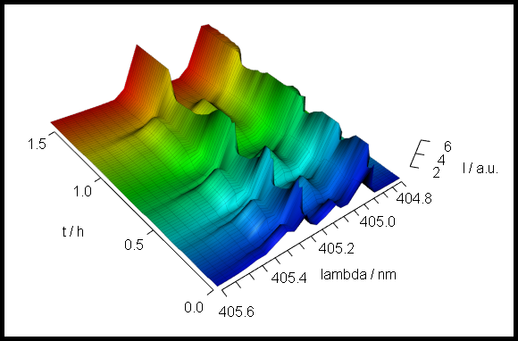

---
# For vignette ---------------------------------------------------------------
title:       Unstable Laser Emission
subtitle:    "Example Workflow for Time-Series Spectra Dataset `laser`"
description: "laser: Example workflow for time-series spectra dataset `laser`."
# Authors --------------------------------------------------------------------
author:
  - name: Claudia Beleites^1,2,3,4,5^, Vilmantas Gegzna
    email: chemometrie@beleites.de
    corresponding : yes
    affiliation   : |
        1. DIA Raman Spectroscopy Group, University of Trieste/Italy (2005--2008)
        2. Spectroscopy $\cdot$ Imaging, IPHT, Jena/Germany (2008--2017)
        3. ÖPV, JKI, Berlin/Germany (2017--2019)
        4. Arbeitskreis Lebensmittelmikrobiologie und Biotechnologie, Hamburg University, Hamburg/Germany (2019 -- 2020)
        5. Chemometric Consulting and Chemometrix GmbH, Wölfersheim/Germany (since 2016)
# Document -------------------------------------------------------------------
date:        "`r Sys.Date()`"
output:
    bookdown::html_document2:
      base_format: rmarkdown::html_vignette
      toc: yes
      fig_caption: yes
      number_sections: true
      css:
        - vignette.css
        - style.css
vignette: >
    % \VignetteIndexEntry{Unstable Laser Emission}
    % \VignetteKeyword{laser}
    % \VignetteKeyword{time series}
    % \VignetteKeyword{hyperSpec}
    % \VignettePackage{hyperSpec}
    % \VignetteDepends{styler}
    % \VignetteEngine{knitr::rmarkdown}
    % \VignetteEncoding{UTF-8}
# Citations/References -------------------------------------------------------
link-citations: yes
bibliography: resources/laser-pkg.bib
biblio-style: plain
csl: elsevier-with-titles.csl
# Pkgdown --------------------------------------------------------------------
pkgdown:
  as_is: true
---


```{r cleanup-laser, include = FALSE}
# Clean up to ensure reproducible workspace ----------------------------------
rm(list = ls(all.names = TRUE))
```

```{r setup, include = FALSE}
# Packages -------------------------------------------------------------------
library(hyperSpec)
# library(rgl)

# Functions ------------------------------------------------------------------
source("vignette-functions.R", encoding = "UTF-8")

# Settings -------------------------------------------------------------------
source("vignette-default-settings.R", encoding = "UTF-8")

# Temporaty options ----------------------------------------------------------
# Change the value of this option in "vignette-default-settings.R"
show_reviewers_notes = getOption("show_reviewers_notes", TRUE)
```

```{r bib, echo=FALSE, paged.print=FALSE}
dir.create("resources", showWarnings = FALSE)

knitr::write_bib(
  c(
    "hyperSpec",
    "rgl"
  ),
  file = "resources/laser-pkg.bib"
)
```


<!-- ======================================================================= -->
```{block, type="note-t", echo=show_reviewers_notes}
**V. Gegzna's notes** `laser-1`


1. `# FIXME:`{.r} After the translation is completed, the contents in the box below must be fixed.
2. `# FIXME:`{.r} do not mention `vignettes.def`
```
<!-- ======================================================================= -->


```{block, type="note", echo=show_reviewers_notes}

`# FIXME. Fix the contents of this box:`{.r}

**Reproducing this vignette.**

All spectra used in this manual are installed automatically with package **hyperSpec**.
The source data files can be found with the command:

`system.file("extdata/laser.txt.gz", package = "hyperSpec")`


```


# Introduction

<!-- ======================================================================= -->
```{block, type="note-t", echo=show_reviewers_notes}
**V. Gegzna's notes** `laser-2`


1. `# NOTE:`{.r} what is "ca." in `recorded during ca. 1.5 h. `

```
<!-- ======================================================================= -->

This data set consists of a time series of `r nrow (laser)` spectra of an unstable laser emission at 405 nm recorded during ca. 1.5 h.

The spectra were recorded  during the installation of the 405 nm laser at a Raman spectrometer.
There is no Raman scattering involved in this data, but the Raman software recorded the abscissa of the spectra as Raman shift in wavenumbers.

This document shows:

-  How to convert the wavelength axis (spectral abscissa),
-  How to display time series data as intensity over time diagram,
-  How to display time series data as 3d and false colour image of intensity as function of time and wavelength.


# Loading the Data and Preprocessing

Load the **hyperSpec** package.

```{r}
library(hyperSpec)
```

Read the data files:

```{r}
# Renishaw file
file  <- system.file("extdata/laser.txt.gz", package = "hyperSpec")
laser <- read.txt.Renishaw(file, data = "ts")
```

```{r include=FALSE}
CAPTION <- "The raw laser emission spectra.  "
```

```{r rawspc, fig.cap=CAPTION}
plot(laser, "spcprctl5")
```

As the laser emission was recorded with a Raman spectrometer, the wavelength axis initially is the Raman shift in wavenumbers (cm^-1^).

As most of the spectra do not show any signal (fig. \@ref(fig:rawspc)), so the spectral range can be cut to -75 -- 0 cm^-1^.
Note that negative numbers in the spectral range specification with the tilde do not exclude the spectral range but rather mean negative values of the wavelength axis.
The results are shown in figure \@ref(fig:cutspc).


```{r include=FALSE}
CAPTION <- "The cut spectra laser emission spectra.   "
```

```{r cutspc, fig.cap=CAPTION}
laser <- laser[, , -75 ~ 0]
plot(laser, "spcprctl5")
```

The wavelength axis was recorded as Raman shift from 405 nm.
However, the spectra were taken before calibrating the wavelength axis.
The band at -50 cm^-1^ is known to be at 405 nm.

```{r wlspc1}
wl(laser) <- wl(laser) + 50
```

Furthermore, as the spectra are not Raman shift but emission, the wavelength axis should be converted to proper wavelengths in nm.

The Raman shift is calculated from the wavelength as follows in equation \@ref(eq:laser-eq-1) with $\Delta\tilde\nu$ being the Raman shift, and $\lambda_0$ the excitation wavelength for a Raman process, here 405 nm.

<!-- Equation ~~~~~~~~~~~~~~~~~~~~~~~~~~~~~~~~~~~~~~~~~~~~~~~~~~~~  -->
\begin{equation}

  \Delta\tilde\nu = \frac{1}{\lambda_0} -  \frac{1}{\lambda}
  (\#eq:laser-eq-1)

\end{equation}
<!-- ~~~~~~~~~~~~~~~~~~~~~~~~~~~~~~~~~~~~~~~~~~~~~~~~~~~~~~~~~~~~~  -->


The wavelengths corresponding to the wavenumbers are thus:

<!-- Equation ~~~~~~~~~~~~~~~~~~~~~~~~~~~~~~~~~~~~~~~~~~~~~~~~~~~~  -->
\begin{equation}

  \lambda = \frac{1}{ \frac{1}{\lambda_0} - \Delta\tilde\nu}
  (\#eq:laser-eq-2)

\end{equation}
<!-- ~~~~~~~~~~~~~~~~~~~~~~~~~~~~~~~~~~~~~~~~~~~~~~~~~~~~~~~~~~~~~  -->


Taking into account that 1 cm = 10$^7$ nm, we arrive at the new wavelength axis:

```{r wlcalc}
wl(laser) <- list(
  wl = 1e7 / (1 / 405e-7 - wl(laser)),
  label = expression(lambda / nm)
)
```


```{r include=FALSE}
CAPTION <- "The spectra with wavelength axis. "
```

```{r wlspc, fig.cap=CAPTION}
plot(laser, "spcprctl5")
```

Note that the new wavelength axis label is immediately assigned as well.


```{r}
laser$filename <- NULL
laser
```
This version of `laser`{.r} datasets is shipped with package **hyperSpec**.


# Inspecting the Time Dependency of the Laser Emission

The maxima of the different emission lines encountered during this measurement are at 405.0, 405.1, 405.3, and 405.4 nm (fig. \@ref(fig:markspc)).

Alternatively they can be extracted from the graph using `locator()`{.r} which reads out the coordinates of the points the user clicks with the mouse (use middle or right click to end the input):

```{r locator, eval=FALSE}
wls <- locator()$x
```

```{r echo=FALSE, results='hide'}
wls <- c(405.0063, 405.1121, 405.2885, 405.3591)
```


```{r include=FALSE}
CAPTION <- "The spectral position of the bands in the laser emission time series. "
```

```{r markspc, fig.cap=CAPTION}
plot(laser, "spcmeansd")

cols <- c("black", "blue", "red", "darkgreen")
abline(v = wls, col = cols)
```

Function `plotc()`{.r} can also be used to plot time-series.
In that case, the abscissa needs to be specified in parameter `use.c`{.r}.
The collection time is stored in column `$t`{.r} in seconds from start of the measurement, and can be handed over as the column name.
The resulting time series are shown in figure \@ref(fig:ts).


```{r include=FALSE}
CAPTION <- "The time series data.
The colors in this plot correspond to colors in fig. \\@ref(fig:ts).  "
```

```{r ts, fig.cap=CAPTION, fig.width=7}
plotc(laser[, , wls], spc ~ t, groups = .wavelength, type = "b", cex = 0.3, col = cols)
```


Another option is to condition the plot on $\lambda$ \@ref(fig:tsextra).


```{r include=FALSE}
CAPTION <- "The time series plots can also be conditioned on `$.wavelength`{.r}. "
```

```{r tsextra, fig.cap=CAPTION, fig.width=7}
plotc(laser[, , wls], spc ~ t | .wavelength, type = "b", cex = 0.3, col = "black")
```


# False-Colour Plot of the Spectral Intensity Over Wavelength and Time {#sec:plotmat}

Package **hyperSpec** supplies functions to draw the spectral matrix using package **lattice**'s `levelplot()`{.r}.


```{r include=FALSE}
CAPTION <- "The spectra matrix of the `laser`{.r} data set.
The ordinate of the plot may be the number of the spectrum accessed by `$.row`{.r} (here) or any other extra data column, as, e.g., `$t`{.r} in fig. \\@ref(fig:plotmatt).  "
```

```{r plotmatr, fig.cap=CAPTION}
plot(laser, "mat", contour = TRUE, col = "#00000060")
```

Package **hyperSpec**'s `levelplot()`{.r} method can be used to display the spectra matrix over a data column (instead of the row number): fig. \@ref(fig:plotmatr), \@ref(fig:plotmatt).
Note that the `hyperSpec`{.r} object is the *second* argument to the function (according to the notation in `levelplot()`{.r}).


```{r include=FALSE}
CAPTION <- "The spectra matrix of the `laser`{.r} data set.
The ordinate of the plot may be any extra data column, here `$t`{.r}.  "
```

```{r plotmatt, fig.cap=CAPTION}
levelplot(spc ~ .wavelength * t, laser, contour = TRUE, col = "#00000080")
```


# A 3D Plot of the Spectral Intensity Over Wavelength and Time {#sec:3d-plot-spectral}

Class `hyperSpec`{.r} objects  can be drawn with package **rgl**[`r cite_pkg("rgl")`]:


Package **rgl**'s function `persp3d()`{.r} plots a surface in 3d defined by points in x, y, and z.
Handing over the appropriate data columns of the `hyperSpec`{.r} object is easy (fig. \@ref(fig:laser3d)).

```{r, eval=FALSE}
library(rgl)
```
```{r rgl-plot, eval=FALSE}
laser   <- laser [, , 404.8 ~ 405.6] / 10000
laser$t <- laser$t / 3600
cols <- rep(matlab.palette(nrow(laser)), nwl(laser))

surface3d(y = wl(laser), x = laser$t, z = laser$spc, col = cols)
surface3d(
  y = wl(laser), x = laser$t, z = laser$spc + .1 * min(laser),
  col = "black", alpha = .2, front = "lines", line_antialias = TRUE
)

aspect3d(c(1, 1, 0.25))

axes3d(c("x+-", "y--", "z--"))
axes3d("y--", nticks = 25, labels = FALSE)
mtext3d("t / h", "x+-", line = 2.5)
mtext3d("lambda / nm", "y--", line = 2.5)
mtext3d("I / a.u.", "z--", line = 2.5)
```

```{r rgl-do, echo=show_reviewers_notes, eval=FALSE, results='hide'}
# ============================================================================
# FIXME: is this code block still needed?
# Does not work correctly on my PC: results in white figure w/o spectra.
# ============================================================================
if (require(rgl)) {
  open3d(windowRect = c(20, 20, 600, 350)) # this is needed only for automatically

  # producing the snapshot
  par3d(
    userMatrix = matrix(c(
      -0.52, 0.4, -0.75, 0,
      -0.85, -0.28, 0.44, 0,
      -0.04, 0.87, 0.49, 0,
      -0.75, 0.75, 0, 1
    ), ncol = 4L),
    scale = c(2.75, 5, 0.175),
    windowRect = c(20L, 50L, 520L, 330L),
    zoom = 0.75
  )
  rgl.snapshot("fig-3D.png", fmt = "png", top = TRUE)
  rgl.quit()
} else {
  png("laser--fig-3D.png")
  ploterrormsg("", "rgl")
  dev.off()
}
```

```{r laser3d, echo=FALSE, fig.cap=CAPTION, out.width="400"}
CAPTION = "The 3d plot of the laser data.  "

```


# Session Info {-}

```{r session-info-laser, paged.print = FALSE}
sessioninfo::session_info("hyperSpec")
```

# References {-}
